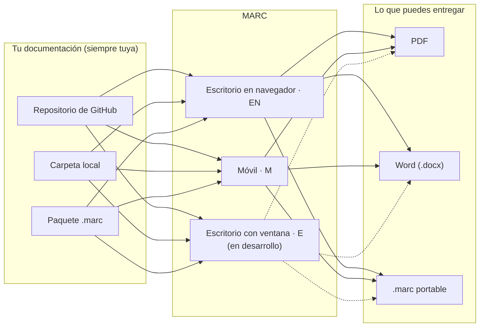

{ width="120" }

# MARC

### Markdown Automatizado por Repo y Consulta

`EN2.0.0` · `M2.0.0`

---

**MARC** es una herramienta para leer, consultar y compartir la documentación técnica de tu equipo **tal como vive en sus archivos Markdown** — en un repositorio de Git, en una carpeta de tu equipo o en un paquete `.marc` — sin depender de un servicio en la nube y sin perder el formato con el que la escribiste.

Empezó como una aplicación de escritorio ligera. Desde la versión 2 es una **familia de ediciones** que comparten motor y formato:

| | **EN** · escritorio en navegador | **E** · escritorio con ventana propia | **M** · móvil |
|---|---|---|---|
| Dónde corre | Windows y Linux, en tu navegador | Windows y Linux, en su propia ventana | Tabletas y teléfonos Android (8 o superior) |
| Idea | **Ligera**: consultar sin tener una aplicación pesada abierta | **Completa**: todas las funciones de MARC en el escritorio | **Completa**: tus wikis en el bolsillo, sin conexión, con edición y asistente de IA |
| Conectar | GitHub, carpeta local, archivo `.marc` | Previsto: las mismas fuentes que M | GitHub, carpeta local, archivo `.marc` y "Abrir con" desde cualquier gestor de archivos |
| Exportar | PDF, Word y `.marc` | Previsto: PDF, Word y `.marc` | PDF, Word y `.marc` |
| Funciones nuevas | Después, si encajan con su ligereza | Primero | Primero |
| Estado | Disponible | En desarrollo | Disponible |
| Guía | Páginas [[01 Conectar tu primer repositorio\|01]] a [[05 Cómo escribir tu documentación\|05]] | — | [[08 MARC en tabletas y teléfonos]] y [[09 Asistente IA]] |

La diferencia entre las tres, por qué existe cada una y cómo conseguirlas está en [[10 Ediciones y versiones]].

> [!info] Filosofía
> Tus archivos son **siempre** la fuente de verdad. MARC los **lee** para mostrarlos y solo **escribe** cuando tú lo decides: al pulsar **Guardar** en el editor, o al **aceptar** un cambio que te propuso el asistente después de revisarlo. Antes de cada guardado, la versión anterior queda respaldada. Lo que se ve distinto en un formato (PDF, Word, la tableta) lo resuelve el motor, nunca tocando tu Markdown.

## Arquitectura descentralizada

MARC no tiene servidor central ni cuenta de usuario:

- No hay una nube de MARC donde tu documentación se suba o se indexe.
- Cada persona conecta **sus propias** fuentes, en su propio equipo o tableta.
- Una vez sincronizada, cada wiki funciona **sin conexión**: también la exportación a PDF y Word, que se genera en tu dispositivo.
- Lo único que puede salir a internet es lo que tú pides: sincronizar con GitHub, o una pregunta al [[09 Asistente IA|asistente]] con el proveedor de IA que tú configures.

En otras palabras: MARC es una capa de lectura y consulta sobre tus archivos, no una plataforma. El control de la información nunca sale de tus manos.

## Empieza aquí

| Página | Qué aprenderás |
|---|---|
| [[01 Conectar tu primer repositorio]] | Conectar GitHub, una carpeta local o un archivo `.marc` en el escritorio |
| [[02 El Hub]] | La pantalla principal: una tarjeta por cada wiki conectada |
| [[03 Navegar la wiki]] | Buscar, moverte entre páginas, cambiar de tema y el menú de opciones |
| [[04 Gestionar tus repositorios]] | Conectar más de una, resincronizar y quitar |
| [[05 Cómo escribir tu documentación]] | Sintaxis soportada y demostraciones en vivo |
| [[06 Exportar PDF, Word y .marc]] | Entregar tu wiki como PDF, documento de Word o paquete portable |
| [[07 El formato .marc]] | Qué es un `.marc` y por qué conviene para compartir |
| [[08 MARC en tabletas y teléfonos]] | La aplicación móvil: carpeta MARC, conectar, leer, editar |
| [[09 Asistente IA]] | Preguntar sobre tus documentos con tu propio proveedor de IA |
| [[10 Ediciones y versiones]] | Las ediciones EN, E y M: diferencias, razón de cada una, cómo conseguirlas y cómo se numeran sus versiones |
| [[11 Preguntas frecuentes]] | Soluciones a los problemas más comunes |
| [[12 Créditos]] | Quién hizo esta herramienta y con qué está construida |

> [!tip] ¿Tienes prisa?
> En el escritorio (EN), ve directo a [[01 Conectar tu primer repositorio]]. En una tableta o teléfono (M), a [[08 MARC en tabletas y teléfonos]]. ¿No sabes cuál edición es la tuya? Ver [[10 Ediciones y versiones]].
