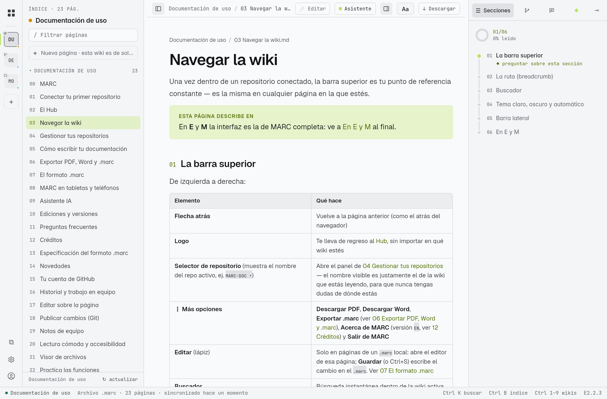
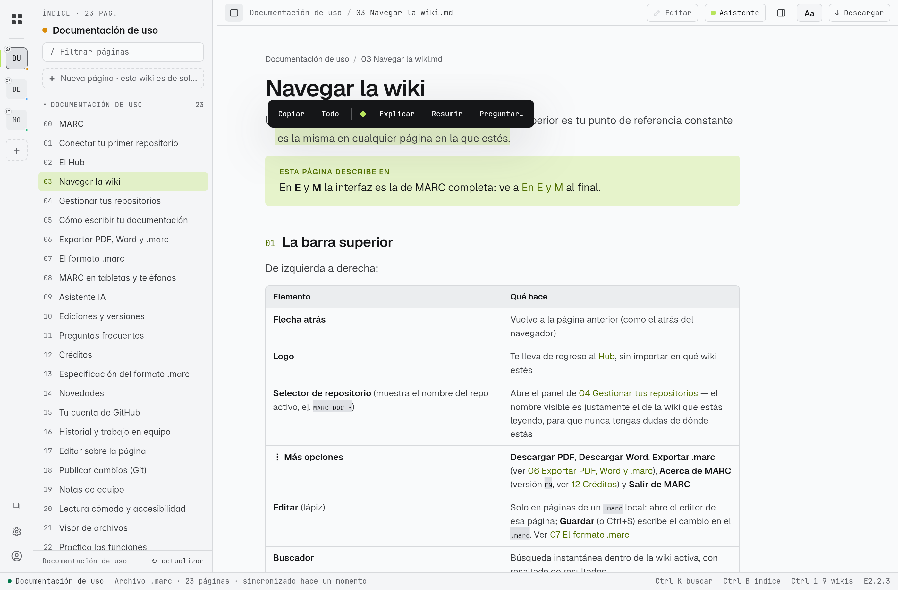

# Navegar la wiki

Una vez dentro de un repositorio conectado, la barra superior es tu punto de referencia constante — es la misma en cualquier página en la que estés.

> [!info] Esta página describe EN
> En **E** y **M** la interfaz es la de MARC completa: ve a [[#En E y M]] al final.

## La barra superior

De izquierda a derecha:

| Elemento | Qué hace |
|---|---|
| **Flecha atrás** | Vuelve a la página anterior (como el atrás del navegador) |
| **Logo** | Te lleva de regreso al [[02 El Hub\|Hub]], sin importar en qué wiki estés |
| **Selector de repositorio** (muestra el nombre del repo activo, ej. `MARC-DOC ▾`) | Abre el panel de [[04 Gestionar tus repositorios]] — el nombre visible es justamente el de la wiki que estás leyendo, para que nunca tengas dudas de dónde estás |
| **⋮ Más opciones** | **Descargar PDF**, **Descargar Word**, **Exportar .marc** (ver [[06 Exportar PDF, Word y .marc]]), **Acerca de MARC** (versión `EN`, ver [[12 Créditos]]) y **Salir de MARC** |
| **Editar** (lápiz) | Solo en páginas de un `.marc` local: abre el editor de esa página; **Guardar** (o Ctrl+S) escribe el cambio en el `.marc`. Ver [[07 El formato .marc]] |
| **Buscador** | Búsqueda instantánea dentro de la wiki activa, con resaltado de resultados |
| **Interruptor de tema** | Alterna entre claro, oscuro y automático (según tu sistema) |

> [!info] Salir de MARC
> "Salir" en el menú **⋮ Más opciones** cierra la app de verdad: apaga el servidor local que corre en tu equipo, no solo la ventana. Te pide confirmación antes de hacerlo — útil si quieres liberar el puerto o la memoria que usa MARC sin tener que buscar el proceso a mano. Volver a abrir MARC lo arranca de nuevo desde cero.

## La ruta (breadcrumb)

Justo debajo de la barra superior verás una ruta tipo `mi-repo / wiki / carpeta / página` — cada segmento, salvo el actual, es un enlace que te lleva directo a ese nivel. Es la forma más rápida de "subir" varios niveles sin usar el botón atrás repetidamente.

## Buscador

El buscador indexa el contenido completo de la wiki activa — no solo títulos. Empieza a escribir y verás resultados con la parte del texto donde aparece tu búsqueda resaltada.

> [!info]
> El buscador solo indexa la wiki que tienes abierta en ese momento. Para buscar *entre* varios repositorios conectados, usa el buscador del [[02 El Hub|Hub]] en su lugar.

## Tema claro, oscuro y automático

El botón de tema en la esquina superior alterna entre modo claro y oscuro. Tu elección se guarda en este dispositivo — la próxima vez que abras la app, se respeta automáticamente. Si nunca lo tocas, la app sigue la preferencia de tu sistema operativo.

## Barra lateral

El ícono de menú (≡) muestra u oculta la barra lateral de navegación, útil en pantallas pequeñas o cuando quieres más espacio para leer.

## En E y M

Las ediciones completas comparten interfaz (en M, adaptada a la pantalla táctil):

| Zona | Qué hay |
|---|---|
| **Barra lateral izquierda** | Tus wikis (fichas), el índice de la wiki abierta con su buscador, **+ Conectar**, ajustes, tu cuenta (E) o el menú **⋯** (M) |
| **Barra de la página** | **«Aa»** ([[20 Lectura cómoda y accesibilidad]]), **Editar** ([[17 Editar sobre la página]]), **Publicar · N** cuando hay cambios ([[18 Publicar cambios (Git)]]), descargar y el botón del panel derecho |
| **Panel derecho** | Pestañas **Secciones** (índice de la página), **Historial** ([[16 Historial y trabajo en equipo]]), **Notas** ([[19 Notas de equipo]]) y **Asistente** ([[09 Asistente IA]]) |
| **Barra de estado** (E) | Rama, último commit, autor y fecha de la wiki con Git |

### El panel derecho se ajusta (E)

Arrastra su **borde izquierdo** para ensancharlo: va desde el ancho inicial hasta el doble, y MARC recuerda tu elección.

### Enlaces dentro de la página

| Enlace a | Se abre |
|---|---|
| Otra página de la wiki (`[[página]]` o `pagina.md`) | En MARC, como siempre |
| Un PDF, texto u otro archivo de la wiki | En el [[21 Visor de archivos|visor]], aparte (`#page=N` para la página exacta) |
| Un `.marc` | Como wiki, desde una copia |
| Una web (`https://…`) | En tu navegador |

### Seleccionar texto

Al seleccionar texto aparece una barra con **Copiar**, **Todo** (toda la página) y las acciones del asistente.

### Abrir con MARC y una sola ventana (E)

Haz **doble clic** en un `.marc` (o elige *Abrir con → MARC* en un `.md`): se abre en MARC. Si MARC ya está abierta, el archivo llega a **la misma ventana**; no se abren copias. Un `.md` se abre como documento para leerlo.
