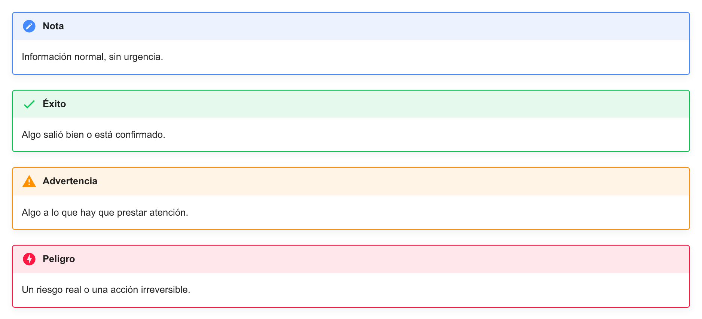
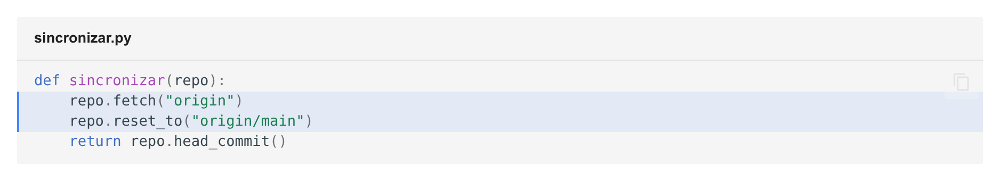
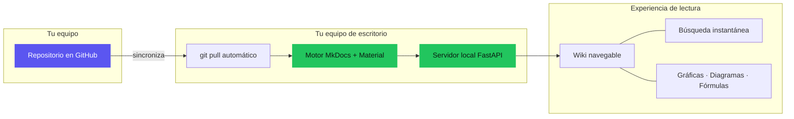
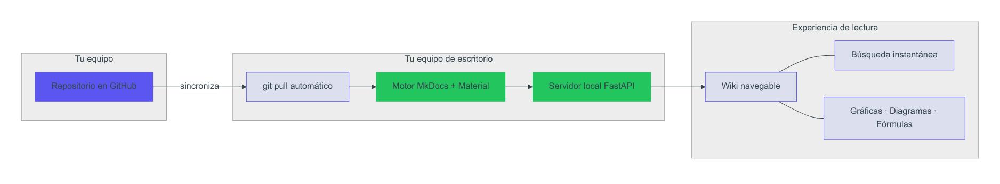
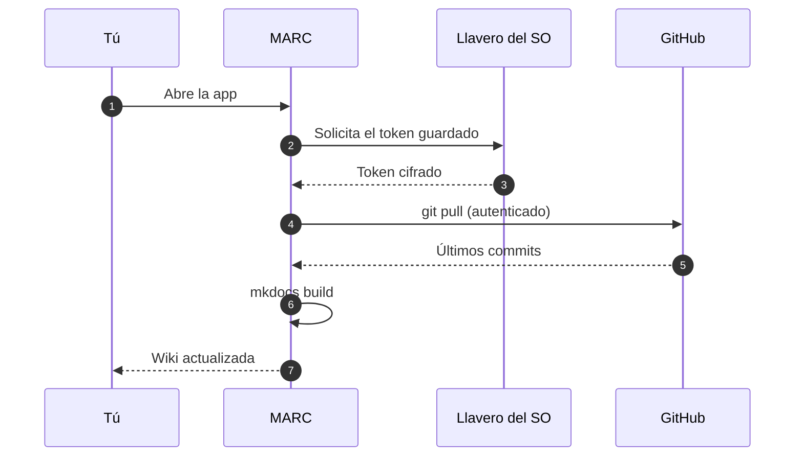
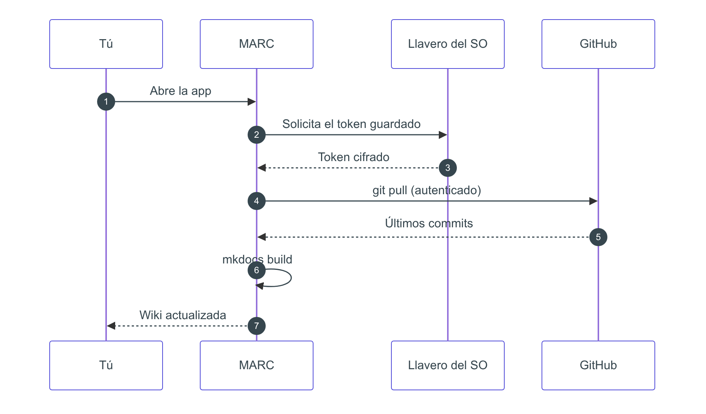
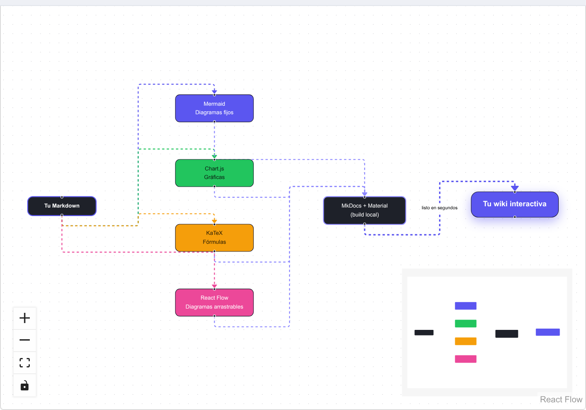
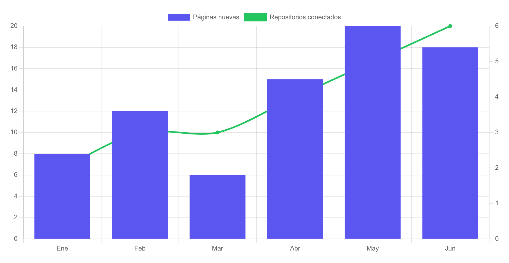

# Cómo escribir tu documentación

Esta página es para quien **escribe** el contenido del repositorio conectado, no solo para quien lo lee. MARC está pensada para equipos que ya escriben en Markdown al estilo Obsidian — estas son las convenciones que soporta y cómo sacarles el máximo provecho.

## Documentación oficial de referencia

MARC no inventa su propia sintaxis: traduce Markdown estándar más un conjunto de extensiones ya establecidas. Si quieres dominar cada una a fondo, esta es la fuente oficial de cada una:

| | Herramienta | Para qué sirve | Documentación oficial |
|---|---|---|---|
| :simple-markdown: | Markdown básico | Títulos, listas, negritas, enlaces, imágenes | [markdownguide.org/basic-syntax](https://www.markdownguide.org/basic-syntax/) |
| :simple-python: | PyMdown Extensions | Motor detrás de tablas, resaltado de código, admonitions y superfences que usa MARC | [facelessuser.github.io/pymdown-extensions](https://facelessuser.github.io/pymdown-extensions/) |
| :simple-obsidian: | Wikilinks (Obsidian) | Sintaxis `[[...]]` para enlazar y transcluir notas | [help.obsidian.md — Internal links](https://help.obsidian.md/Linking+notes+and+files/Internal+links) |
| :simple-obsidian: | Callouts (Obsidian) | Sintaxis `> [!tipo]` para recuadros de aviso | [help.obsidian.md — Callouts](https://help.obsidian.md/Editing+and+formatting/Callouts) |
| :simple-mermaid: | Mermaid | Diagramas de flujo, secuencia, Gantt y más como código | [mermaid.js.org](https://mermaid.js.org/intro/) |
| :material-vector-polyline: | React Flow | Diagramas de nodos que el lector puede arrastrar y reacomodar | [reactflow.dev](https://reactflow.dev/) |
| :simple-chartdotjs: | Chart.js | Gráficas de datos configurables por JSON | [chartjs.org/docs/latest](https://www.chartjs.org/docs/latest/) |
| :simple-latex: | KaTeX | Notación matemática en LaTeX | [katex.org — Supported functions](https://katex.org/docs/supported.html) |
| :material-shape: | Material Design Icons | Catálogo completo de iconos disponibles vía `:nombre:` | [pictogrammers.com/library/mdi](https://pictogrammers.com/library/mdi/) |

> [!tip]
> Si algo se ve distinto a lo que esperabas, casi siempre la respuesta está en una de estas páginas — MARC solo renderiza lo que estos motores ya definen, no agrega reglas propias por encima.

## Nombres de archivo

Escribe tus archivos como te sea natural: con espacios, mayúsculas, acentos — `01 Guía de despliegue.md` es perfectamente válido. La app genera automáticamente una URL limpia para cada página (minúsculas, sin espacios ni acentos) **sin tocar tu archivo fuente**. Tu repositorio nunca se modifica por esto.

## Portada automática

No necesitas un `index.md`. Si tu repositorio no trae uno, la app abre automáticamente la primera página disponible al entrar a la wiki.

> [!tip] Recomendación
> Numera tus archivos (`00 Portada.md`, `01 ...`, `02 ...`) para controlar el orden de navegación y asegurar que la primera página sea la que quieres como portada. Así está escrita esta misma documentación que estás leyendo.

## Enlaces estilo Obsidian (wikilinks)

Puedes enlazar entre páginas con la sintaxis `[[...]]`, igual que en [Obsidian](https://help.obsidian.md/Linking+notes+and+files/Internal+links):

| Escribes | Resultado |
|---|---|
| `[[Nombre de la nota]]` | Enlace a esa página |
| `[[Nombre de la nota#Sección]]` | Enlace directo a una sección de esa página |
| `[[Nombre de la nota\|Texto a mostrar]]` | Enlace con un texto distinto al nombre del archivo |

## Transclusión (embeber una nota dentro de otra)

Con `!` antes de los corchetes, en vez de enlazar, **incrustas** el contenido:

| Escribes | Resultado |
|---|---|
| `![[Nombre de la nota]]` | Incrusta el contenido completo de esa nota aquí mismo |
| `![[Nombre de la nota#Sección]]` | Incrusta solo esa sección |

## Callouts (recuadros de aviso)

Misma sintaxis que [Obsidian](https://help.obsidian.md/Editing+and+formatting/Callouts), con `> [!tipo]`. MARC soporta el catálogo completo de admonitions de Material for MkDocs, no solo cuatro tipos:

```
> [!note] Nota
> Información normal, sin urgencia.

> [!tip] Consejo
> Un atajo o buena práctica.

> [!success] Éxito
> Algo salió bien o está confirmado.

> [!question] Pregunta
> Algo que vale la pena cuestionar o verificar.

> [!warning] Advertencia
> Algo a lo que hay que prestar atención.

> [!danger] Peligro
> Un riesgo real o una acción irreversible.

> [!example] Ejemplo
> Un caso concreto que ilustra el punto anterior.

> [!quote] Cita
> Una cita textual de otra fuente.
```

Se ven así de renderizados:

> [!note] Nota
> Información normal, sin urgencia.

> [!success] Éxito
> Algo salió bien o está confirmado.

> [!warning] Advertencia
> Algo a lo que hay que prestar atención.

> [!danger] Peligro
> Un riesgo real o una acción irreversible.

**Así se ve una vez renderizado:**



## Bloques de código

Cualquier bloque con tres comillas invertidas y el nombre del lenguaje trae resaltado de sintaxis y un botón de copiar. También puedes resaltar líneas específicas con `hl_lines` y darle un título al bloque:

````
```python title="sincronizar.py" hl_lines="2 3"
def sincronizar(repo):
    repo.fetch("origin")
    repo.reset_to("origin/main")
    return repo.head_commit()
```
````

Se ve así de renderizado:

```python title="sincronizar.py" hl_lines="2 3"
def sincronizar(repo):
    repo.fetch("origin")
    repo.reset_to("origin/main")
    return repo.head_commit()
```

**Así se ve una vez renderizado** (título de archivo + líneas 2 y 3 resaltadas + botón de copiar):



## Diagramas Mermaid

Los bloques ` ```mermaid ` se renderizan como diagramas reales, no como texto — soportan todo lo que [Mermaid](https://mermaid.js.org/intro/) define: flowcharts, diagramas de secuencia, Gantt, ER, y más.

**Ejemplo — arquitectura de MARC como flowchart con subgrafos y estilos:**

````

````

Se ve así de renderizado:


**Así se ve una vez renderizado:**



**Ejemplo — diagrama de secuencia:**

````

````

Se ve así de renderizado:


**Así se ve una vez renderizado:**



## Diagramas arrastrables (React Flow)

Mermaid es perfecto para un diagrama que solo necesita leerse — pero es un SVG fijo, sus nodos no se mueven. Cuando quieras que **quien lee reacomode el diagrama a su gusto** (explorar una arquitectura grande, reordenar un mapa de dependencias, o simplemente jugar con la disposición), usa un bloque ` ```flow ` en su lugar: se renderiza con [React Flow](https://reactflow.dev/), y cada nodo se arrastra con el mouse.

A diferencia de Mermaid (una sintaxis de texto que se traduce a diagrama), aquí escribes directamente la estructura de nodos y conexiones en JSON — el mismo formato nativo que usa React Flow internamente, igual que los bloques ` ```chart ` escriben configuración nativa de Chart.js.

**Ejemplo — cómo tu Markdown se convierte en la wiki final, con los cuatro motores de contenido interactivo en paralelo:**

````
```flow
{
  "nodes": [
    { "id": "md", "position": { "x": 0, "y": 220 },
      "data": { "label": "Tu Markdown" },
      "style": { "background": "#1e2129", "color": "#fff", "border": "2px solid #5b56f0", "borderRadius": 12, "padding": 10, "fontWeight": 600, "width": 150 } },

    { "id": "mermaid", "position": { "x": 320, "y": 0 },
      "data": { "label": "Mermaid\nDiagramas fijos" },
      "style": { "background": "#5b56f0", "color": "#fff", "borderRadius": 10, "padding": 10, "whiteSpace": "pre-line", "textAlign": "center", "width": 170 } },
    { "id": "chart", "position": { "x": 320, "y": 140 },
      "data": { "label": "Chart.js\nGráficas" },
      "style": { "background": "#22c55e", "color": "#0b1a10", "borderRadius": 10, "padding": 10, "whiteSpace": "pre-line", "textAlign": "center", "width": 170 } },
    { "id": "katex", "position": { "x": 320, "y": 280 },
      "data": { "label": "KaTeX\nFórmulas" },
      "style": { "background": "#f59e0b", "color": "#231a06", "borderRadius": 10, "padding": 10, "whiteSpace": "pre-line", "textAlign": "center", "width": 170 } },
    { "id": "flow", "position": { "x": 320, "y": 420 },
      "data": { "label": "React Flow\nDiagramas arrastrables" },
      "style": { "background": "#ec4899", "color": "#fff", "borderRadius": 10, "padding": 10, "whiteSpace": "pre-line", "textAlign": "center", "width": 170 } },

    { "id": "engine", "position": { "x": 640, "y": 220 },
      "data": { "label": "MkDocs + Material\n(build local)" },
      "style": { "background": "#1e2129", "color": "#fff", "border": "2px solid #8b86ff", "borderRadius": 10, "padding": 10, "whiteSpace": "pre-line", "textAlign": "center", "width": 180 } },

    { "id": "wiki", "position": { "x": 960, "y": 210 },
      "data": { "label": "Tu wiki interactiva" },
      "style": { "background": "#5b56f0", "color": "#fff", "borderRadius": 16, "padding": 14, "fontWeight": 700, "fontSize": 16, "width": 190, "boxShadow": "0 8px 24px rgba(91,86,240,0.45)" } }
  ],
  "edges": [
    { "id": "e-md-mermaid", "source": "md", "target": "mermaid", "animated": true, "type": "smoothstep", "style": { "stroke": "#5b56f0", "strokeWidth": 2 }, "markerEnd": { "type": "arrowclosed", "color": "#5b56f0" } },
    { "id": "e-md-chart", "source": "md", "target": "chart", "animated": true, "type": "smoothstep", "style": { "stroke": "#22c55e", "strokeWidth": 2 }, "markerEnd": { "type": "arrowclosed", "color": "#22c55e" } },
    { "id": "e-md-katex", "source": "md", "target": "katex", "animated": true, "type": "smoothstep", "style": { "stroke": "#f59e0b", "strokeWidth": 2 }, "markerEnd": { "type": "arrowclosed", "color": "#f59e0b" } },
    { "id": "e-md-flow", "source": "md", "target": "flow", "animated": true, "type": "smoothstep", "style": { "stroke": "#ec4899", "strokeWidth": 2 }, "markerEnd": { "type": "arrowclosed", "color": "#ec4899" } },

    { "id": "e-mermaid-engine", "source": "mermaid", "target": "engine", "animated": true, "type": "smoothstep", "style": { "stroke": "#8b86ff", "strokeWidth": 2 }, "markerEnd": { "type": "arrowclosed", "color": "#8b86ff" } },
    { "id": "e-chart-engine", "source": "chart", "target": "engine", "animated": true, "type": "smoothstep", "style": { "stroke": "#8b86ff", "strokeWidth": 2 }, "markerEnd": { "type": "arrowclosed", "color": "#8b86ff" } },
    { "id": "e-katex-engine", "source": "katex", "target": "engine", "animated": true, "type": "smoothstep", "style": { "stroke": "#8b86ff", "strokeWidth": 2 }, "markerEnd": { "type": "arrowclosed", "color": "#8b86ff" } },
    { "id": "e-flow-engine", "source": "flow", "target": "engine", "animated": true, "type": "smoothstep", "style": { "stroke": "#8b86ff", "strokeWidth": 2 }, "markerEnd": { "type": "arrowclosed", "color": "#8b86ff" } },

    { "id": "e-engine-wiki", "source": "engine", "target": "wiki", "animated": true, "type": "smoothstep", "label": "listo en segundos", "style": { "stroke": "#5b56f0", "strokeWidth": 3 }, "markerEnd": { "type": "arrowclosed", "color": "#5b56f0" } }
  ]
}
```
````

Se ve así de renderizado:

```flow
{
  "nodes": [
    { "id": "md", "position": { "x": 0, "y": 220 },
      "data": { "label": "Tu Markdown" },
      "style": { "background": "#1e2129", "color": "#fff", "border": "2px solid #5b56f0", "borderRadius": 12, "padding": 10, "fontWeight": 600, "width": 150 } },

    { "id": "mermaid", "position": { "x": 320, "y": 0 },
      "data": { "label": "Mermaid\nDiagramas fijos" },
      "style": { "background": "#5b56f0", "color": "#fff", "borderRadius": 10, "padding": 10, "whiteSpace": "pre-line", "textAlign": "center", "width": 170 } },
    { "id": "chart", "position": { "x": 320, "y": 140 },
      "data": { "label": "Chart.js\nGráficas" },
      "style": { "background": "#22c55e", "color": "#0b1a10", "borderRadius": 10, "padding": 10, "whiteSpace": "pre-line", "textAlign": "center", "width": 170 } },
    { "id": "katex", "position": { "x": 320, "y": 280 },
      "data": { "label": "KaTeX\nFórmulas" },
      "style": { "background": "#f59e0b", "color": "#231a06", "borderRadius": 10, "padding": 10, "whiteSpace": "pre-line", "textAlign": "center", "width": 170 } },
    { "id": "flow", "position": { "x": 320, "y": 420 },
      "data": { "label": "React Flow\nDiagramas arrastrables" },
      "style": { "background": "#ec4899", "color": "#fff", "borderRadius": 10, "padding": 10, "whiteSpace": "pre-line", "textAlign": "center", "width": 170 } },

    { "id": "engine", "position": { "x": 640, "y": 220 },
      "data": { "label": "MkDocs + Material\n(build local)" },
      "style": { "background": "#1e2129", "color": "#fff", "border": "2px solid #8b86ff", "borderRadius": 10, "padding": 10, "whiteSpace": "pre-line", "textAlign": "center", "width": 180 } },

    { "id": "wiki", "position": { "x": 960, "y": 210 },
      "data": { "label": "Tu wiki interactiva" },
      "style": { "background": "#5b56f0", "color": "#fff", "borderRadius": 16, "padding": 14, "fontWeight": 700, "fontSize": 16, "width": 190, "boxShadow": "0 8px 24px rgba(91,86,240,0.45)" } }
  ],
  "edges": [
    { "id": "e-md-mermaid", "source": "md", "target": "mermaid", "animated": true, "type": "smoothstep", "style": { "stroke": "#5b56f0", "strokeWidth": 2 }, "markerEnd": { "type": "arrowclosed", "color": "#5b56f0" } },
    { "id": "e-md-chart", "source": "md", "target": "chart", "animated": true, "type": "smoothstep", "style": { "stroke": "#22c55e", "strokeWidth": 2 }, "markerEnd": { "type": "arrowclosed", "color": "#22c55e" } },
    { "id": "e-md-katex", "source": "md", "target": "katex", "animated": true, "type": "smoothstep", "style": { "stroke": "#f59e0b", "strokeWidth": 2 }, "markerEnd": { "type": "arrowclosed", "color": "#f59e0b" } },
    { "id": "e-md-flow", "source": "md", "target": "flow", "animated": true, "type": "smoothstep", "style": { "stroke": "#ec4899", "strokeWidth": 2 }, "markerEnd": { "type": "arrowclosed", "color": "#ec4899" } },

    { "id": "e-mermaid-engine", "source": "mermaid", "target": "engine", "animated": true, "type": "smoothstep", "style": { "stroke": "#8b86ff", "strokeWidth": 2 }, "markerEnd": { "type": "arrowclosed", "color": "#8b86ff" } },
    { "id": "e-chart-engine", "source": "chart", "target": "engine", "animated": true, "type": "smoothstep", "style": { "stroke": "#8b86ff", "strokeWidth": 2 }, "markerEnd": { "type": "arrowclosed", "color": "#8b86ff" } },
    { "id": "e-katex-engine", "source": "katex", "target": "engine", "animated": true, "type": "smoothstep", "style": { "stroke": "#8b86ff", "strokeWidth": 2 }, "markerEnd": { "type": "arrowclosed", "color": "#8b86ff" } },
    { "id": "e-flow-engine", "source": "flow", "target": "engine", "animated": true, "type": "smoothstep", "style": { "stroke": "#8b86ff", "strokeWidth": 2 }, "markerEnd": { "type": "arrowclosed", "color": "#8b86ff" } },

    { "id": "e-engine-wiki", "source": "engine", "target": "wiki", "animated": true, "type": "smoothstep", "label": "listo en segundos", "style": { "stroke": "#5b56f0", "strokeWidth": 3 }, "markerEnd": { "type": "arrowclosed", "color": "#5b56f0" } }
  ]
}
```

**Así se ve una vez renderizado** (arrastra cualquier nodo — la posición inicial es solo un punto de partida, no un límite):



> [!tip] Rendimiento e interacción
> Igual que las gráficas, los diagramas ` ```flow ` se cargan de forma perezosa. Además de arrastrar nodos, el lector puede hacer zoom, desplazarse (pan) y usar el minimapa de la esquina para ubicarse en diagramas grandes.

## Gráficas

Los bloques ` ```chart ` se renderizan como gráficas reales de [Chart.js](https://www.chartjs.org/docs/latest/), no como texto. Escribes la configuración completa en JSON — tipo de gráfica, etiquetas, datos, ejes y colores — exactamente igual que llamarías a `new Chart(ctx, config)` en JavaScript.

**Ejemplo — gráfica mixta (barras + línea) con doble eje:**

````
```chart
{
  "type": "bar",
  "data": {
    "labels": ["Ene", "Feb", "Mar", "Abr", "May", "Jun"],
    "datasets": [
      {
        "type": "bar",
        "label": "Páginas nuevas",
        "data": [8, 12, 6, 15, 20, 18],
        "backgroundColor": "#5b56f0"
      },
      {
        "type": "line",
        "label": "Repositorios conectados",
        "data": [2, 3, 3, 4, 5, 6],
        "borderColor": "#22c55e",
        "backgroundColor": "#22c55e",
        "yAxisID": "y1",
        "tension": 0.3
      }
    ]
  },
  "options": {
    "scales": {
      "y": { "beginAtZero": true },
      "y1": { "beginAtZero": true, "position": "right", "grid": { "drawOnChartArea": false } }
    }
  }
}
```
````

Se ve así de renderizado:

```chart
{
  "type": "bar",
  "data": {
    "labels": ["Ene", "Feb", "Mar", "Abr", "May", "Jun"],
    "datasets": [
      {
        "type": "bar",
        "label": "Páginas nuevas",
        "data": [8, 12, 6, 15, 20, 18],
        "backgroundColor": "#5b56f0"
      },
      {
        "type": "line",
        "label": "Repositorios conectados",
        "data": [2, 3, 3, 4, 5, 6],
        "borderColor": "#22c55e",
        "backgroundColor": "#22c55e",
        "yAxisID": "y1",
        "tension": 0.3
      }
    ]
  },
  "options": {
    "scales": {
      "y": { "beginAtZero": true },
      "y1": { "beginAtZero": true, "position": "right", "grid": { "drawOnChartArea": false } }
    }
  }
}
```

**Así se ve una vez renderizado:**



> [!tip] Rendimiento
> Las gráficas se cargan de forma perezosa: si tu página tiene diez gráficas y el lector nunca hace scroll hasta la última, esa nunca se procesa. Y si tu JSON tiene un error de sintaxis, la app te avisa en el propio bloque en vez de romper el resto de la página.

## Fórmulas matemáticas

Escribe LaTeX entre signos de dólar y se renderiza como notación matemática real, vía [KaTeX](https://katex.org/) — útil para documentación técnica con álgebra, estadística o cualquier notación formal.

| Escribes | Resultado |
|---|---|
| `$x^2 + y^2 = z^2$` (en medio de una frase) | Fórmula en línea: $x^2 + y^2 = z^2$ |
| `$$ ... $$` en su propio bloque | Fórmula centrada, en tamaño grande |

Un bloque completo:

```
$$
\frac{-b \pm \sqrt{b^2 - 4ac}}{2a}
$$
```

Se ve así de renderizado:

$$
\frac{-b \pm \sqrt{b^2 - 4ac}}{2a}
$$

**Así se ve una vez renderizado** (útil si estás leyendo esto en GitHub, donde KaTeX no se ejecuta):


> [!note] Un precio no es una fórmula
> Si escribes "cuesta $5 y $10", la app es lo bastante lista para no confundir eso con matemáticas — necesita un signo de dólar pegado a la fórmula, sin espacio de por medio, para activarse.

## Iconos

Escribe el nombre del icono entre dos puntos y se inserta como parte del documento — no es una imagen que se descarga, es una forma vectorial que ya vive dentro de la app:

| Escribes | Resultado |
|---|---|
| `:material-rocket-launch:` | :material-rocket-launch: |
| `:material-alert:` | :material-alert: |
| `:material-check-circle:` | :material-check-circle: |
| `:material-lock:` | :material-lock: |

Sirven para dar contexto visual rápido sin escribir una sola imagen: por ejemplo, para marcar de un vistazo el estado de una sección (:material-check-circle: listo, :material-alert: pendiente de revisión) o para acompañar un título con algo más reconocible que texto plano.

## Tablas

Tablas Markdown estándar — como las que ya viste en esta misma página.

## Resumen

| Necesitas | Sintaxis |
|---|---|
| Enlazar otra página | `[[Nota]]` |
| Enlazar una sección | `[[Nota#Sección]]` |
| Incrustar otra nota completa | `![[Nota]]` |
| Aviso o nota destacada | `> [!tipo]` |
| Diagrama | ` ```mermaid ` |
| Diagrama arrastrable | ` ```flow ` |
| Gráfica de datos | ` ```chart ` |
| Fórmula matemática | `$...$` o `$$...$$` |
| Icono | `:nombre-del-icono:` |
| Código con resaltado | ` ```lenguaje ` |
