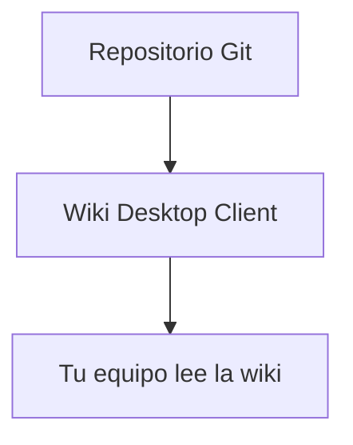

# Cómo escribir tu documentación

Esta página es para quien **escribe** el contenido del repositorio conectado, no solo para quien lo lee. Wiki Desktop Client está pensada para equipos que ya escriben en Markdown al estilo Obsidian — estas son las convenciones que soporta y cómo sacarles el máximo provecho.

## Nombres de archivo

Escribe tus archivos como te sea natural: con espacios, mayúsculas, acentos — `01 Guía de despliegue.md` es perfectamente válido. La app genera automáticamente una URL limpia para cada página (minúsculas, sin espacios ni acentos) **sin tocar tu archivo fuente**. Tu repositorio nunca se modifica por esto.

## Portada automática

No necesitas un `index.md`. Si tu repositorio no trae uno, la app abre automáticamente la primera página disponible al entrar a la wiki.

> [!tip] Recomendación
> Numera tus archivos (`00 Bienvenida.md`, `01 ...`, `02 ...`) para controlar el orden de navegación y asegurar que la primera página sea la que quieres como portada. Así está escrita esta misma documentación que estás leyendo.

## Enlaces estilo Obsidian (wikilinks)

Puedes enlazar entre páginas con la sintaxis `[[...]]`, igual que en Obsidian:

| Escribes | Resultado |
|---|---|
| `[[Nombre de la nota]]` | Enlace a esa página |
| `[[Nombre de la nota#Sección]]` | Enlace directo a una sección de esa página |
| `[[Nombre de la nota\|Texto a mostrar]]` | Enlace con un texto distinto al nombre del archivo |

## Transclusión (embeber una nota dentro de otra)

Con `!` antes de los corchetes, en vez de enlazar, **incrustas** el contenido:

| Escribes | Resultado |
|---|---|
| `![[Nombre de la nota]]` | Incrusta el contenido completo de esa nota aquí mismo |
| `![[Nombre de la nota#Sección]]` | Incrusta solo esa sección |

## Callouts (recuadros de aviso)

Misma sintaxis que Obsidian, con `> [!tipo]`:

```
> [!note]
> Una nota informativa normal.

> [!tip]
> Un consejo o atajo.

> [!warning]
> Algo a lo que hay que prestar atención.

> [!danger]
> Un riesgo real o una acción irreversible.
```

Se ven así de renderizados:

> [!note]
> Una nota informativa normal.

> [!warning]
> Algo a lo que hay que prestar atención.

## Bloques de código

Cualquier bloque con tres comillas invertidas y el nombre del lenguaje trae resaltado de sintaxis y un botón de copiar:

````
```python
def hola():
    return "mundo"
```
````

## Diagramas Mermaid

Los bloques ` ```mermaid ` se renderizan como diagramas reales, no como texto:

````

````

Se ve así de renderizado:


## Gráficas

Los bloques ` ```chart ` se renderizan como gráficas reales de [Chart.js](https://www.chartjs.org/), no como texto. Escribes la configuración en JSON — tipo de gráfica, etiquetas, datos y colores:

````
```chart
{
  "type": "bar",
  "data": {
    "labels": ["Lun", "Mar", "Mié", "Jue", "Vie"],
    "datasets": [{
      "label": "Páginas leídas",
      "data": [12, 19, 8, 15, 22],
      "backgroundColor": "#5b56f0"
    }]
  }
}
```
````

Se ve así de renderizado:

```chart
{
  "type": "bar",
  "data": {
    "labels": ["Lun", "Mar", "Mié", "Jue", "Vie"],
    "datasets": [{
      "label": "Páginas leídas",
      "data": [12, 19, 8, 15, 22],
      "backgroundColor": "#5b56f0"
    }]
  }
}
```

> [!tip] Rendimiento
> Las gráficas se cargan de forma perezosa: si tu página tiene diez gráficas y el lector nunca hace scroll hasta la última, esa nunca se procesa. Y si tu JSON tiene un error de sintaxis, la app te avisa en el propio bloque en vez de romper el resto de la página.

## Fórmulas matemáticas

Escribe LaTeX entre signos de dólar y se renderiza como notación matemática real, vía [KaTeX](https://katex.org/) — útil para documentación técnica con álgebra, estadística o cualquier notación formal.

| Escribes | Resultado |
|---|---|
| `$x^2 + y^2 = z^2$` (en medio de una frase) | Fórmula en línea: $x^2 + y^2 = z^2$ |
| `$$ ... $$` en su propio bloque | Fórmula centrada, en tamaño grande |

Un bloque completo:

```
$$
\frac{-b \pm \sqrt{b^2 - 4ac}}{2a}
$$
```

Se ve así de renderizado:

$$
\frac{-b \pm \sqrt{b^2 - 4ac}}{2a}
$$

> [!note] Un precio no es una fórmula
> Si escribes "cuesta $5 y $10", la app es lo bastante lista para no confundir eso con matemáticas — necesita un signo de dólar pegado a la fórmula, sin espacio de por medio, para activarse.

## Iconos

Escribe el nombre del icono entre dos puntos y se inserta como parte del documento — no es una imagen que se descarga, es una forma vectorial que ya vive dentro de la app:

| Escribes | Resultado |
|---|---|
| `:material-rocket-launch:` | :material-rocket-launch: |
| `:material-alert:` | :material-alert: |
| `:material-check-circle:` | :material-check-circle: |
| `:material-lock:` | :material-lock: |

Sirven para dar contexto visual rápido sin escribir una sola imagen: por ejemplo, para marcar de un vistazo el estado de una sección (:material-check-circle: listo, :material-alert: pendiente de revisión) o para acompañar un título con algo más reconocible que texto plano.

## Tablas

Tablas Markdown estándar — como las que ya viste en esta misma página.

## Resumen

| Necesitas | Sintaxis |
|---|---|
| Enlazar otra página | `[[Nota]]` |
| Enlazar una sección | `[[Nota#Sección]]` |
| Incrustar otra nota completa | `![[Nota]]` |
| Aviso o nota destacada | `> [!tipo]` |
| Diagrama | ` ```mermaid ` |
| Gráfica de datos | ` ```chart ` |
| Fórmula matemática | `$...$` o `$$...$$` |
| Icono | `:nombre-del-icono:` |
| Código con resaltado | ` ```lenguaje ` |
