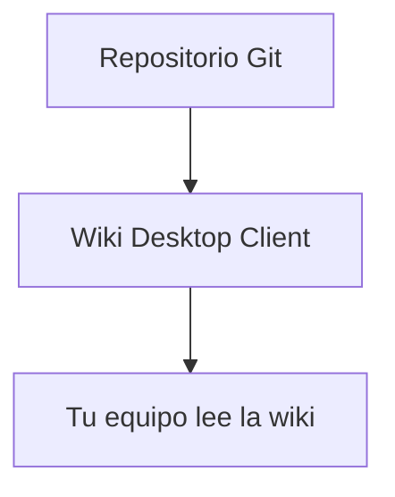

# Cómo escribir tu documentación

Esta página es para quien **escribe** el contenido del repositorio conectado, no solo para quien lo lee. Wiki Desktop Client está pensada para equipos que ya escriben en Markdown al estilo Obsidian — estas son las convenciones que soporta y cómo sacarles el máximo provecho.

## Nombres de archivo

Escribe tus archivos como te sea natural: con espacios, mayúsculas, acentos — `01 Guía de despliegue.md` es perfectamente válido. La app genera automáticamente una URL limpia para cada página (minúsculas, sin espacios ni acentos) **sin tocar tu archivo fuente**. Tu repositorio nunca se modifica por esto.

## Portada automática

No necesitas un `index.md`. Si tu repositorio no trae uno, la app abre automáticamente la primera página disponible al entrar a la wiki.

> [!tip] Recomendación
> Numera tus archivos (`00 Bienvenida.md`, `01 ...`, `02 ...`) para controlar el orden de navegación y asegurar que la primera página sea la que quieres como portada. Así está escrita esta misma documentación que estás leyendo.

## Enlaces estilo Obsidian (wikilinks)

Puedes enlazar entre páginas con la sintaxis `[[...]]`, igual que en Obsidian:

| Escribes | Resultado |
|---|---|
| `[[Nombre de la nota]]` | Enlace a esa página |
| `[[Nombre de la nota#Sección]]` | Enlace directo a una sección de esa página |
| `[[Nombre de la nota\|Texto a mostrar]]` | Enlace con un texto distinto al nombre del archivo |

## Transclusión (embeber una nota dentro de otra)

Con `!` antes de los corchetes, en vez de enlazar, **incrustas** el contenido:

| Escribes | Resultado |
|---|---|
| `![[Nombre de la nota]]` | Incrusta el contenido completo de esa nota aquí mismo |
| `![[Nombre de la nota#Sección]]` | Incrusta solo esa sección |

## Callouts (recuadros de aviso)

Misma sintaxis que Obsidian, con `> [!tipo]`:

```
> [!note]
> Una nota informativa normal.

> [!tip]
> Un consejo o atajo.

> [!warning]
> Algo a lo que hay que prestar atención.

> [!danger]
> Un riesgo real o una acción irreversible.
```

Se ven así de renderizados:

> [!note]
> Una nota informativa normal.

> [!warning]
> Algo a lo que hay que prestar atención.

## Bloques de código

Cualquier bloque con tres comillas invertidas y el nombre del lenguaje trae resaltado de sintaxis y un botón de copiar:

````
```python
def hola():
    return "mundo"
```
````

## Diagramas Mermaid

Los bloques ` ```mermaid ` se renderizan como diagramas reales, no como texto:

````

````

## Tablas

Tablas Markdown estándar — como las que ya viste en esta misma página.

## Resumen

| Necesitas | Sintaxis |
|---|---|
| Enlazar otra página | `[[Nota]]` |
| Enlazar una sección | `[[Nota#Sección]]` |
| Incrustar otra nota completa | `![[Nota]]` |
| Aviso o nota destacada | `> [!tipo]` |
| Diagrama | ` ```mermaid ` |
| Código con resaltado | ` ```lenguaje ` |
