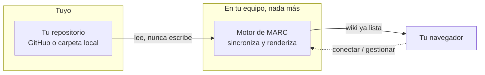

# Créditos

## Acerca de MARC

**MARC** — *Markdown Automatizado por Repo y Consulta* — nació con otro nombre de trabajo, **Wiki Desktop Client**, mientras la idea todavía se estaba probando: leer la documentación técnica de un equipo directo desde su repositorio de Git, sin nube, sin plataforma, sin fricción. El nombre cambió; la idea y la arquitectura descentralizada detrás — ver [[00 Portada|Portada]] — se mantienen igual desde el primer commit.

`v1.3.1`

## Arquitectura, a grandes rasgos

MARC corre **100% en tu equipo**: no hay ningún servidor de MARC en internet al que tu documentación viaje. Lo único que existe es un proceso local que lee tu repositorio (o carpeta) y te sirve el resultado ya renderizado en tu propio navegador.



> [!info] Por qué no hay más detalle que este
> Esta página nombra las tecnologías con las que está construido MARC porque no es ningún secreto — son herramientas públicas, cualquiera puede instalarlas. Lo que no vas a encontrar aquí es un mapa de cómo se combinan por dentro: eso no le sirve a alguien que solo quiere *usar* MARC, y una wiki de usuario no es el lugar para exponerlo.

## Stack técnico

| | Capa | Herramienta |
|---|---|---|
| :simple-python: | Motor y empaquetado | [Python](https://www.python.org/), autocontenido en la app instalada — no necesitas tener Python instalado en tu equipo |
| :simple-fastapi: | Servidor local | [FastAPI](https://fastapi.tiangolo.com/) sobre [Uvicorn](https://www.uvicorn.org/) |
| :simple-materialformkdocs: | Traducción de Markdown → HTML | [MkDocs](https://www.mkdocs.org/) + [Material for MkDocs](https://squidfunk.github.io/mkdocs-material/) |
| :simple-git: | Clonado y sincronización de repos | [pygit2](https://www.pygit2.org/) (libgit2), sin depender de `git` instalado en el sistema |
| :material-key-variant: | Almacenamiento seguro de tokens | [`keyring`](https://pypi.org/project/keyring/), sobre el llavero nativo del sistema operativo |
| :simple-mermaid: | Diagramas fijos | [Mermaid](https://mermaid.js.org/) |
| :simple-react: | Diagramas arrastrables | [React Flow](https://reactflow.dev/) |
| :simple-chartdotjs: | Gráficas | [Chart.js](https://www.chartjs.org/) |
| :simple-latex: | Fórmulas matemáticas | [KaTeX](https://katex.org/) |
| :simple-obsidian: | Wikilinks, transclusión y callouts estilo Obsidian | [mkdocs-obsidian-links](https://pypi.org/project/mkdocs-obsidian-links/), [mkdocs-embed-file-plugins](https://pypi.org/project/mkdocs-embed-file-plugins/), [mkdocs-callouts](https://pypi.org/project/mkdocs-callouts/) |
| :simple-typescript: | Herramientas visuales del lado del navegador | [TypeScript](https://www.typescriptlang.org/), compilado con [esbuild](https://esbuild.github.io/) |
| :material-package-variant-closed: | Instalador de escritorio | NSIS en Windows, `.deb` en Linux — ambos empaquetan Python y todo lo anterior, sin dependencias que instalar aparte |

Todas las librerías de terceros están vendorizadas — nada se carga desde un CDN — para que la wiki funcione completamente sin conexión una vez sincronizada.

## Creado por Antonio Baeza

- GitHub: [github.com/Anton-Bazh](https://github.com/Anton-Bazh)
- Correo: [baezaantoniocontacto@gmail.com](mailto:baezaantoniocontacto@gmail.com)

```
          .                                                      .
        .n                   .                 .                  n.
  .   .dP                  dP                   9b                 9b.    .
 4    qXb         .       dX                     Xb       .        dXp     t
dX.    9Xb      .dXb    __                         __    dXb.     dXP     .Xb
9XXb._       _.dXXXXb dXXXXbo.                 .odXXXXb dXXXXb._       _.dXXP
 9XXXXXXXXXXXXXXXXXXXVXXXXXXXXOo.           .oOXXXXXXXXVXXXXXXXXXXXXXXXXXXXP
  `9XXXXXXXXXXXXXXXXXXXXX'~   ~`OOO8b   d8OOO'~   ~`XXXXXXXXXXXXXXXXXXXXXP'
    `9XXXXXXXXXXXP' `9XX'   DIE    `98v8P'  HUMAN   `XXP' `9XXXXXXXXXXXP'
        ~~~~~~~       9X.          .db|db.          .XP       ~~~~~~~
                        )b.  .dbo.dP'`v'`9b.odb.  .dX(
                      ,dXXXXXXXXXXXb     dXXXXXXXXXXXb.
                     dXXXXXXXXXXXP'   .   `9XXXXXXXXXXXb
                    dXXXXXXXXXXXXb   d|b   dXXXXXXXXXXXXb
                    9XXb'   `XXXXXb.dX|Xb.dXXXXX'   `dXXP
                     `'      9XXXXXX(   )XXXXXXP      `'
                              XXXX X.`v'.X XXXX
                              XP^X'`b   d'`X^XX
                              X. 9  `   '  P )X
                              `b  `       '  d'
                               `             '

           mmmmmm        mmm    mmmmm    mmmmmmmm      mmm
           ##""""##     m###   #""""##m  """""###     m###
     mmm#  ##    ##    #" ##        m##      ##"     #" ##   #mmm
 mm#"""    #######   m#"  ##     #####     m##"    m#"  ##     """#mm
 ""#mmm    ##    ##  ########       "##   m##      ########    mmm#""
     """#  ##mmmm##       ##   #mmmm##"  ###mmmmm       ##   #"""
           """""""        ""    """""    """"""""       ""
```
