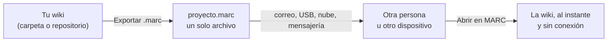
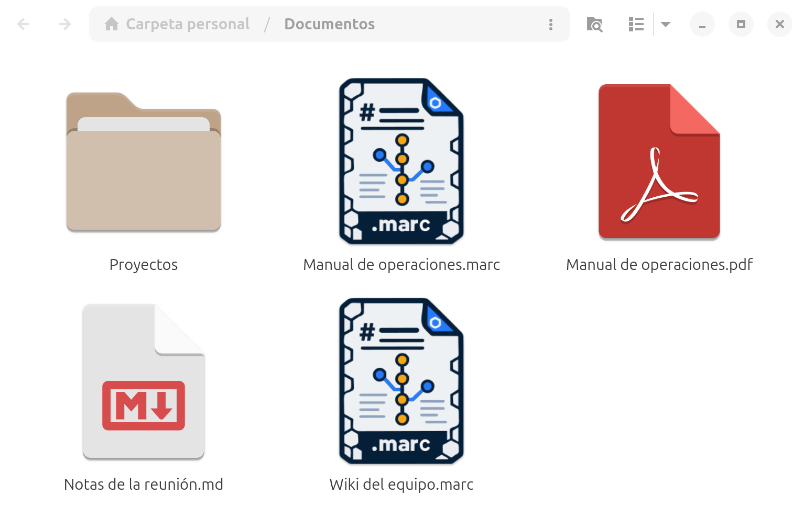
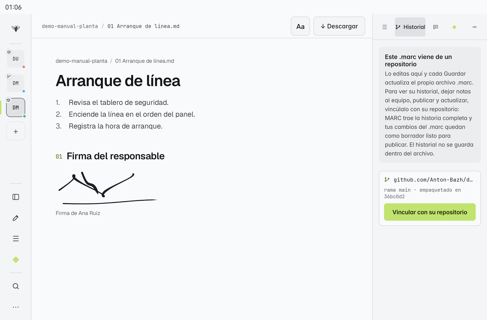
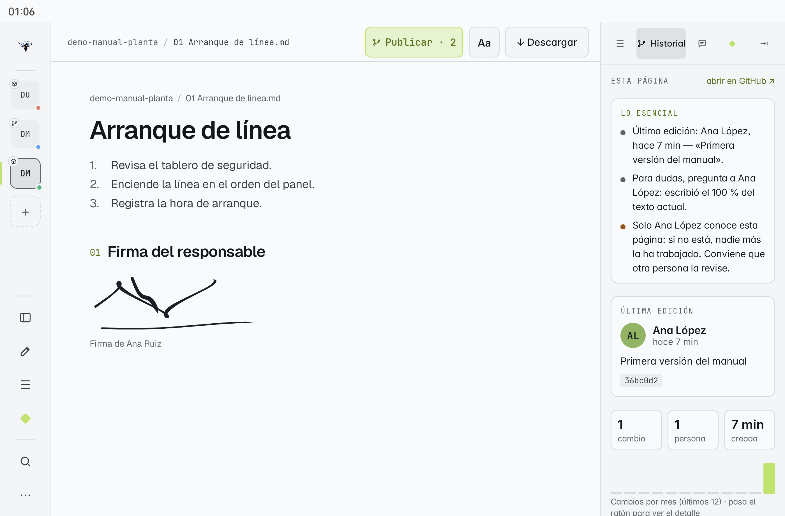

# El formato .marc

Un archivo **`.marc`** es una wiki completa empaquetada en un solo archivo: todas sus páginas Markdown, sus imágenes, sus adjuntos y una ficha con su origen. Es el formato portable de MARC: el mismo archivo se abre en el escritorio y en el móvil.

## Un formato abierto

El `.marc` no es un formato cerrado de MARC: es un **ZIP estándar** con una estructura sencilla y documentada.

- Cambia `.marc` por `.zip` y cualquier programa de compresión lo abre; adentro están tus archivos Markdown e imágenes tal cual, sin pérdida de calidad.
- Cualquiera puede **crear o leer** `.marc` con sus propias herramientas (un script, otra aplicación, una integración continua), sin necesitar MARC.
- La especificación oficial, con el formato del manifiesto, las reglas de seguridad y ejemplos listos para usar, está en [[13 Especificación del formato .marc]].

## Para qué sirve

- **Compartir** una wiki con alguien que no tiene acceso a tu repositorio de GitHub.
- **Llevarte** una wiki a la tableta sin depender de internet.
- **Archivar** una versión de tu documentación en un solo archivo.

## Abrir un .marc

| Dónde | Cómo |
|---|---|
| Escritorio | Hub → **Abrir archivo .marc**, o en el panel de conexión la pestaña **Archivo .marc** |
| Móvil | **+ Conectar** → "o abre un archivo .marc", o tocar el archivo en tu gestor de archivos y elegir **Abrir con → MARC** |

En el escritorio, con E instalada, los `.marc` llevan su propio icono en el gestor de archivos y se abren con **doble clic**:

MARC comprueba que el archivo sea un `.marc` válido antes de abrirlo; si no lo es, solo te avisa. Abrir el **mismo** archivo otra vez no crea una copia nueva: vuelve a abrir la que ya tenías.

## Editable, sin pérdida y vinculable

Un `.marc` es la wiki completa en un solo archivo, pensada para viajar y seguir trabajándose:

| | Qué significa |
|---|---|
| **Portable** | El mismo archivo se abre en el escritorio y en la tableta, sin conexión |
| **Editable** | En E y M, cada **Guardar** reescribe el propio `.marc` de forma segura: si algo falla a la mitad, el archivo original queda intacto |
| **Sin pérdida** | Lleva páginas, imágenes, adjuntos y su ficha de origen (repositorio, rama y commit) |
| **Vinculable** | Si salió de un repositorio de Git, se conecta con él para ver el historial y publicar |

Cada `.marc` recuerda de dónde salió:

| Origen | En E y M | En EN (ligera) |
|---|---|---|
| **Git** (exportado de un repositorio) | Editable y **vinculable** con su repositorio | Solo lectura; avisa si el repositorio tiene una versión más nueva |
| **Local** (exportado de una carpeta) | Editable | Editable |

## Vincular un .marc con su repositorio

Un `.marc` de origen Git trae en su ficha el repositorio y el commit del que salió. En **Historial** (panel derecho) verás *«Este .marc viene de un repositorio»* y el botón **Vincular con su repositorio**:

1. MARC trae **toda la historia** del repositorio y la coloca en el commit del `.marc`.
2. Lo que editaste en el `.marc` queda como **borrador**: no se pierde ni se mezcla con trabajo ajeno.
3. Trae lo que el equipo publicó después (como **↻ actualizar**) y une los dos trabajos.

Desde ahí la wiki funciona como cualquier wiki con Git: **Historial**, **Notas de equipo**, **Publicar · N** y **↻ actualizar** ([[16 Historial y trabajo en equipo]], [[18 Publicar cambios (Git)]]). Cada vez que publicas o actualizas, MARC reescribe también el `.marc` con el contenido y el commit nuevos, así el archivo que compartes sigue al día.

> [!tip] Repositorio privado
> Inicia sesión con tu [[15 Tu cuenta de GitHub|cuenta de GitHub]] antes de vincular. El `.marc` nunca guarda tu sesión ni tus tokens.

> [!note] La historia vive en el repositorio
> El archivo `.marc` no lleva el historial de Git dentro (tendría correos de otras personas y crecería mucho): lo trae el vínculo. Un `.marc` de **carpeta local** no tiene repositorio que vincular; para darle historia, **Publicar en GitHub** desde la carpeta original.

En **EN**, un `.marc` de Git sigue en solo lectura (la edición ligera no tiene Git).

> [!info] Tus tokens nunca viajan en el .marc
> Si el repositorio de origen es privado, el `.marc` no lleva ningún token ni contraseña. Para vincularlo o consultar si hay versión nueva, MARC usa tu sesión de GitHub o un token guardado aparte, en el almacén seguro de tu sistema.

## Crear un .marc

Desde la wiki que quieras compartir: **Exportar .marc** (escritorio) o **Descargar → Formato portable** (móvil). Ver [[06 Exportar PDF, Word y .marc]].
