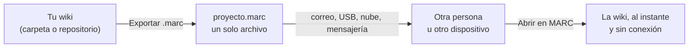

# El formato .marc

Un archivo **`.marc`** es una wiki completa empaquetada en un solo archivo: todas sus páginas Markdown, sus imágenes, sus adjuntos y una ficha con su origen. Es el formato portable de MARC: el mismo archivo se abre en el escritorio y en el móvil.

## Un formato abierto

El `.marc` no es un formato cerrado de MARC: es un **ZIP estándar** con una estructura sencilla y documentada.

- Cambia `.marc` por `.zip` y cualquier programa de compresión lo abre; adentro están tus archivos Markdown e imágenes tal cual, sin pérdida de calidad.
- Cualquiera puede **crear o leer** `.marc` con sus propias herramientas (un script, otra aplicación, una integración continua), sin necesitar MARC.
- La especificación oficial, con el formato del manifiesto, las reglas de seguridad y ejemplos listos para usar, está en [[13 Especificación del formato .marc]].

## Para qué sirve

- **Compartir** una wiki con alguien que no tiene acceso a tu repositorio de GitHub.
- **Llevarte** una wiki a la tableta sin depender de internet.
- **Archivar** una versión de tu documentación en un solo archivo.

## Abrir un .marc

| Dónde | Cómo |
|---|---|
| Escritorio | Hub → **Abrir archivo .marc**, o en el panel de conexión la pestaña **Archivo .marc** |
| Móvil | **+ Conectar** → "o abre un archivo .marc", o tocar el archivo en tu gestor de archivos y elegir **Abrir con → MARC** |

MARC comprueba que el archivo sea un `.marc` válido antes de abrirlo; si no lo es, solo te avisa. Abrir el **mismo** archivo otra vez no crea una copia nueva: vuelve a abrir la que ya tenías.

## Solo lectura o editable

Cada `.marc` recuerda de dónde salió:

| Origen | En MARC |
|---|---|
| **Git** (exportado de un repositorio de GitHub) | **Solo lectura** en el escritorio: la fuente de verdad es el repositorio. MARC te avisa si el repositorio tiene una versión más nueva |
| **Local** (exportado de una carpeta) | **Editable**: al guardar, MARC reescribe el `.marc` con el cambio, de forma segura (si algo falla a la mitad, el archivo original queda intacto) |

> [!info] Tus tokens nunca viajan en el .marc
> Si el repositorio de origen es privado, el `.marc` no lleva ningún token ni contraseña. Para consultar si hay versión nueva, MARC te pide el token aparte y lo guarda en el almacén seguro de tu sistema.

## Crear un .marc

Desde la wiki que quieras compartir: **Exportar .marc** (escritorio) o **Descargar → Formato portable** (móvil). Ver [[06 Exportar PDF, Word y .marc]].
