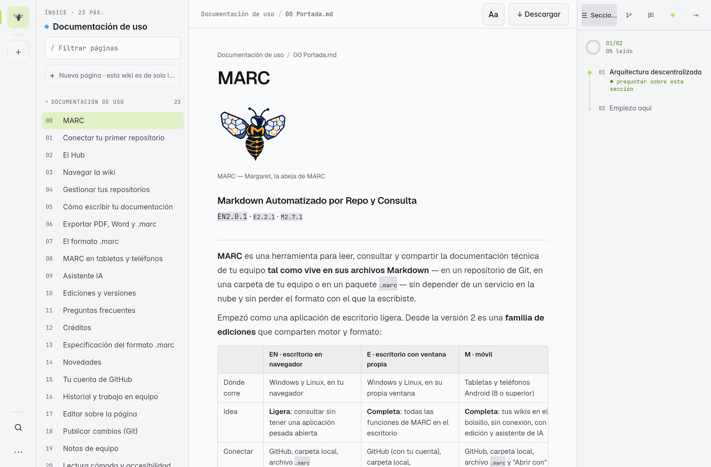
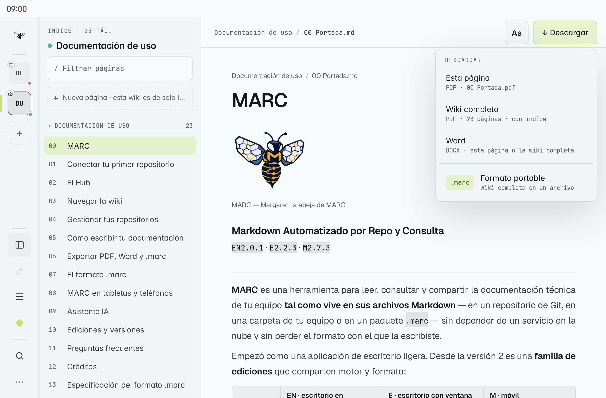
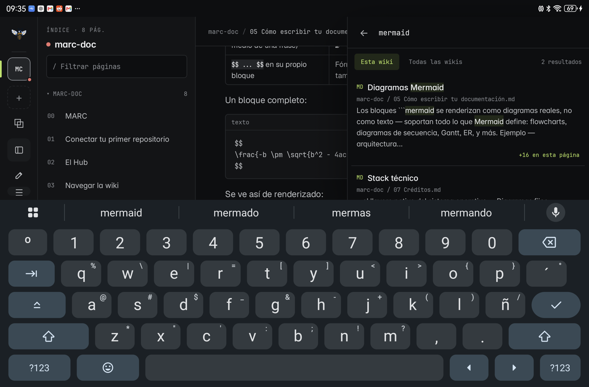
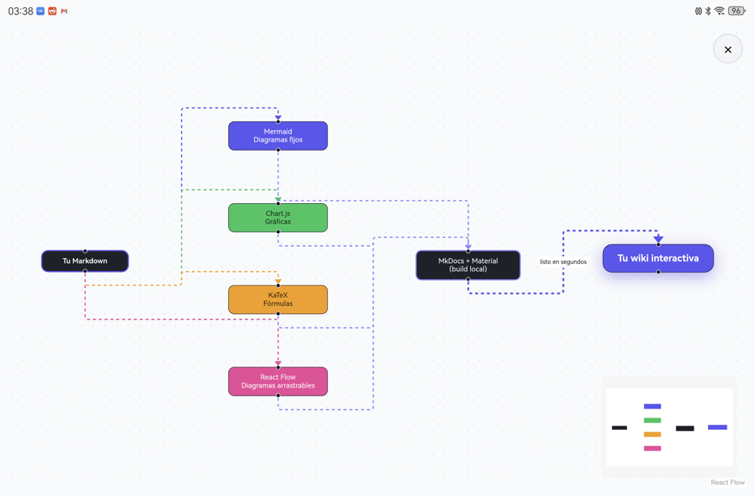

# MARC en tabletas y teléfonos

**MARC móvil** (versiones `M`) es la aplicación de MARC para tabletas y teléfonos Android 8 o superior. Lee las mismas wikis que el escritorio, con el mismo motor para Markdown, diagramas, gráficas y fórmulas, y funciona **sin conexión**.

## La carpeta MARC

La primera vez, MARC te pide permiso para crear una carpeta **`MARC`** en la raíz de tu almacenamiento. Android lo llama *acceso a todos los archivos*: MARC solo escribe dentro de `MARC` y en los archivos que tú abres para editar; nunca borra ni modifica nada más.

| Carpeta | Qué guarda |
|---|---|
| `MARC/Wikis` | Las wikis conectadas: el clon de cada repositorio, cada `.marc` abierto y una **copia** de cada carpeta local (tu carpeta original nunca se mueve) |
| `MARC/Paquetes .marc` | Los `.marc` que exportas |
| `MARC/PDF` | Los PDF que generas |
| `MARC/Word` | Los documentos de Word (`.docx`) que generas |
| `MARC/Respaldos` | La versión anterior de cada archivo, guardada justo antes de que tú o el asistente guarden un cambio. Por wiki y por fecha |

> [!tip] Sin permiso también funciona
> Si eliges **Ahora no**, MARC funciona igual con una copia interna, y cada exportación te pregunta dónde guardar. Puedes dar el permiso después en **Ajustes → Wikis → Carpeta MARC**.

## Conectar una wiki

Toca **+** en la barra lateral o **+ Conectar** en el inicio (pestañas **Git**, **Carpeta local** y **Crear**; los `.marc` se abren con *Abrir con MARC*):

| Fuente | Qué hace MARC |
|---|---|
| **Git** | Lo clona por HTTPS con **todo su historial** en `MARC/Wikis`: de tu lista de GitHub (con tu [[15 Tu cuenta de GitHub\|cuenta]], también privados) o pegando la URL (privado con token) |
| **Crear** | Una wiki nueva en GitHub o local ([[01 Conectar tu primer repositorio#En E y M]]) |
| **Carpeta local** | Hace una copia de lectura en `MARC/Wikis`. Si la carpeta ya está **dentro** de `MARC/Wikis`, la usa tal cual, sin copiarla |
| **Archivo .marc** | Lo abre y lo extrae en `MARC/Wikis`. Ver [[07 El formato .marc]] |

### Abrir con MARC

Desde cualquier gestor de archivos, toca un archivo y elige **Abrir con → MARC**:

- **`.marc`**: se abre como wiki (si ya estaba conectado, vuelve a abrir el mismo).
- **`.md`**: si pertenece a una wiki conectada, se abre **esa página** dentro de su wiki; si es un archivo suelto, se abre como **documento de una página**, con sus imágenes. Al editarlo, el cambio se guarda en el archivo original.

## Moverte por la app

La barra lateral está organizada por zonas:

| Zona | Qué hay |
|---|---|
| Arriba | Inicio (tus wikis) y hasta **4 fichas** de wiki; la que lees siempre se ve. Si tienes más, una ficha **+N** abre un selector con búsqueda. **Mantén pulsada** una ficha para quitar esa wiki. Debajo, **+** para conectar |
| En medio (solo con una página abierta) | Índice, Editar, Secciones y Asistente |
| Abajo | Buscar y **⋯ Más opciones** |

**⋯ Más opciones** cambia según dónde estés: en el inicio muestra lo general (**Iniciar sesión con GitHub** o tu cuenta, Tema, Documentación de uso, Extensiones, Ajustes, Acerca de); dentro de una página agrega las descargas y **Actualizar desde el origen**.

## Leer

- **Índice** a la izquierda y **Secciones** a la derecha, con el avance de lectura de la página.
- **Buscar** (la lupa, o Ctrl K con teclado) busca en todas tus wikis o solo en la actual, con la coincidencia resaltada.
- Toca un diagrama, una gráfica o una imagen para verla **a pantalla completa** con zoom (pellizcar, arrastrar, doble toque). Un toque o *atrás* la cierra.
- Los diagramas **React Flow** son interactivos dentro de la página; su botón **ver en grande** los abre a pantalla completa (se cierra con × o *atrás*).
- Las gráficas son interactivas: toca un punto para ver su valor.
- **Extensiones** (en ⋯) enciende o apaga KaTeX, Mermaid, Chart.js y React Flow; apagadas, se muestra su código fuente.
- Al **seleccionar texto** (mantén pulsado) aparece la barra de MARC: **Copiar**, **Todo** (toda la página), y Explicar, Resumir o Preguntar al [[09 Asistente IA|asistente]].
- Los enlaces a **PDF y textos** de la wiki se abren en el [[21 Visor de archivos|visor]], en ventana flotante o pantalla dividida.

## Editar

El lápiz de la barra lateral abre el editor de la página, en modo **Visual** (escribes sobre la página) o **Markdown**: ver [[17 Editar sobre la página]]. Al **Guardar**:

| Origen de la wiki | Dónde se guarda |
|---|---|
| Carpeta local | En la copia de `MARC/Wikis` **y** en tu carpeta original; MARC lo verifica leyéndolo de nuevo y, si falla, restaura la versión anterior |
| Archivo `.marc` | Se reescribe el `.marc` original con el cambio |
| Git | En el clon de la tableta, como **borrador**: aparece **Publicar · N** para subirlo en un commit ([[18 Publicar cambios (Git)]]) |
| Documento `.md` suelto | En el archivo original |
| Documentación de uso | **Solo lectura**: el lápiz se ve atenuado y el editor no se abre |

Antes de cada guardado, la versión anterior queda en `MARC/Respaldos`.

## Exportar

**Descargar** (arriba a la derecha de cada página) ofrece PDF de esta página o de la wiki completa, **Word** y **Formato portable** (`.marc`). Ver [[06 Exportar PDF, Word y .marc]].

## Quitar una wiki

En el inicio, **mantén pulsada** su tarjeta y confirma. El mensaje te dice exactamente qué se borra:

- una wiki de Git, un `.marc` o la copia de una carpeta: se borra su carpeta en `MARC/Wikis`; tu repositorio, tu `.marc` y tu carpeta original no se tocan;
- un clon de Git con cambios sin subir: se mueve a `MARC/Respaldos` en vez de borrarse;
- una carpeta que ya vivía en `MARC/Wikis` o un `.md` suelto: **nunca se borran**, solo se quitan de MARC.

## Ajustes

**Ajustes** tiene cinco pestañas: **Apariencia** (tema, color de acento, tamaño del texto y [[21 Visor de archivos|visor de archivos]]), **Accesibilidad** ([[20 Lectura cómoda y accesibilidad]]), **IA** (ver [[09 Asistente IA]]), **Wikis** (origen de cada wiki, actualizar, exportar, quitar, carpeta MARC) y **Acerca de** (versión `M`).

## Lo nuevo en la tableta (M2.1.0 a M2.3.2)

| Función | Dónde | Página |
|---|---|---|
| **Iniciar sesión con GitHub** | ⋯ → Iniciar sesión con GitHub | [[15 Tu cuenta de GitHub]] |
| **Publicar** y **↻ actualizar** con Git de verdad (sin instalar nada) | Publicar · N en la barra de la página | [[18 Publicar cambios (Git)]] |
| **Historial**, autoría y comparar; **Traer historial completo** para wikis viejas | Panel derecho → Historial | [[16 Historial y trabajo en equipo]] |
| **Notas de equipo** | Panel derecho → Notas | [[19 Notas de equipo]] |
| **«Aa»**, modo dislexia, luz de noche, regla, énfasis y **lector de voz** | «Aa» en la barra de la página; Ajustes → Accesibilidad | [[20 Lectura cómoda y accesibilidad]] |
| **Visor** de PDF y textos | Toca un enlace a un archivo | [[21 Visor de archivos]] |

> [!warning] Voz en tabletas Huawei
> Si **Escuchar esta página** no suena, casi siempre falta una voz en tu idioma. En Huawei, descarga el **modelo de voz** de tu idioma en los ajustes del motor de Huawei (pasos en [[20 Lectura cómoda y accesibilidad#Voz en Huawei|Voz en Huawei]]); en Android con Google, instala **Servicios de voz de Google**. Guía completa en [[20 Lectura cómoda y accesibilidad#Si no se oye]].

> [!note] Para probarlo
> [[22 Practica las funciones]] trae una wiki de práctica editable y un PDF de prueba.
