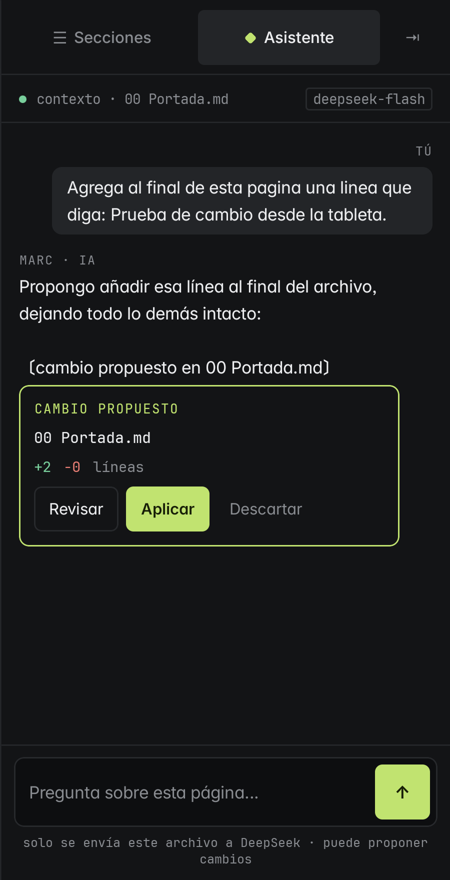
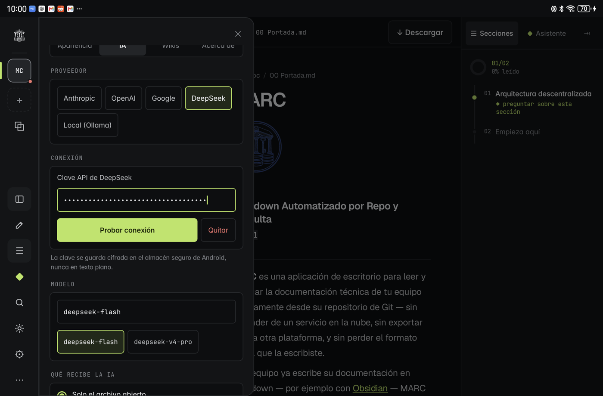
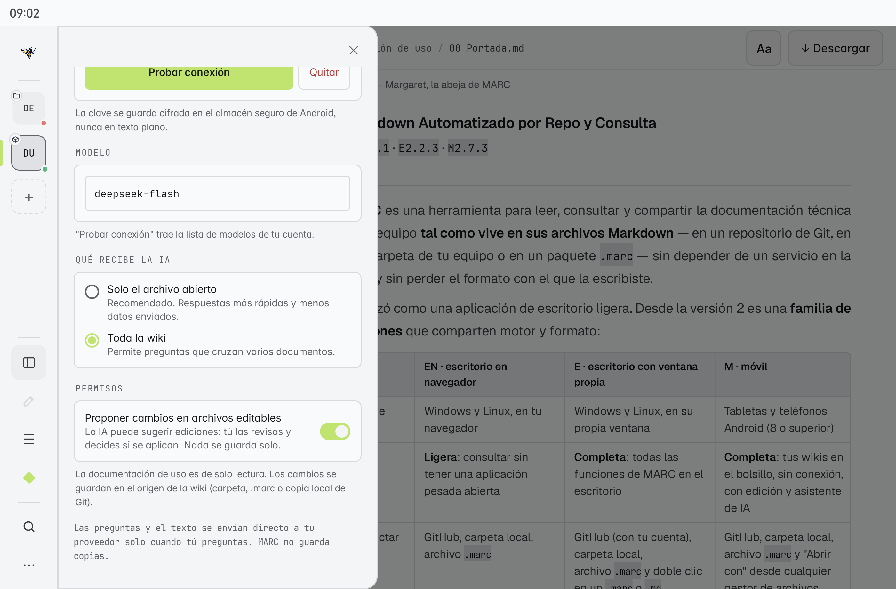
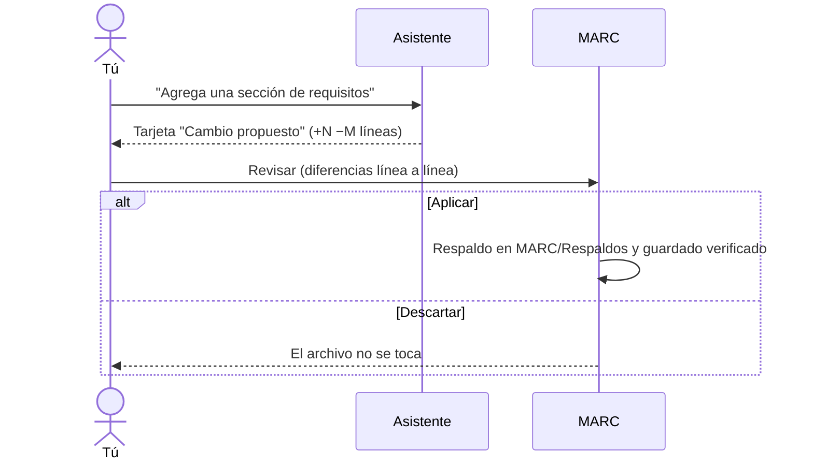

# Asistente IA

MARC móvil trae un **asistente** para preguntar sobre tus documentos: resumir una página, explicar una sección, encontrar decisiones o pendientes. MARC **no incluye un modelo propio**: usas tu cuenta del proveedor que prefieras, con tu propia clave.

## Configurarlo

En **Ajustes → IA**:

| Paso | Qué hacer |
|---|---|
| Proveedor | Anthropic, OpenAI, Google, DeepSeek o **Local (Ollama)** en tu propia red |
| Conexión | Pega tu clave API (u, para Ollama, la dirección de tu equipo) y toca **Probar conexión** |
| Modelo | Escríbelo o elige uno de la lista que trae *Probar conexión* |
| Qué recibe la IA | **Solo el archivo abierto** (recomendado: más rápido y envía menos) o **Toda la wiki** |

> [!info] Tus claves
> Cada proveedor guarda **su propia** clave, cifrada en el almacén seguro de Android. Nunca se escribe en un archivo, nunca va en un `.marc` y nunca se muestra completa.

## Preguntar

Abre una página y toca el rombo **Asistente** en la barra lateral, o selecciona texto y elige **Explicar**, **Resumir** o **Preguntar**.

- La respuesta llega mientras se escribe; si el modelo está razonando, verás *pensando…*.
- Cuando cita una sección, la cita (por ejemplo `§03`) es un botón que te lleva a esa sección.
- Si algo no está en tus documentos, el asistente lo dice en vez de inventarlo.

## Proponer cambios (opcional)

El asistente puede **proponer cambios en archivos editables** desde el primer momento. El pie del chat indica si puede hacerlo; lo apagas o enciendes ahí («activar») o en **Ajustes → IA → Permisos**.

- **Nunca se aplica solo:** cada cambio se revisa con sus diferencias y tú decides aplicarlo o descartarlo.
- Se guarda igual que una edición tuya (ver [[08 MARC en tabletas y teléfonos]]), con su respaldo previo.
- La documentación de uso es de solo lectura: el asistente nunca propone cambios sobre ella.

## Imágenes

Adjunta imágenes con el **clip** (en el escritorio también puedes **arrastrarlas** a la conversación): el asistente las ve y puede **colocarlas en la wiki** o **mover** las que ya existen, siguiendo la carpeta `imagenes/` de cada sección o el estilo que ya use tu wiki. Igual que los cambios de texto, cada imagen que guarda o mueve aparece como una tarjeta que tú aplicas; con varias, **Aplicar todo**.

- Hasta 6 imágenes por pregunta (PNG, JPG, GIF o WebP, hasta 5 MB cada una).
- Hace falta un modelo que vea imágenes (por ejemplo `deepseek-flash`); si el tuyo no puede, MARC te lo dice.
- Solo puede guardar imágenes donde tu wiki es el original (un repositorio, una carpeta o un documento abierto con «Abrir con»); en un `.marc` solo conversa.

## Dictado

Toca el **micrófono** y habla: el texto queda en el campo para que lo revises antes de enviarlo. En el escritorio funciona **sin conexión** (la primera vez descarga el modelo de voz en español, unos 40 MB); en la tableta usa el reconocedor de voz del dispositivo.

## Copiar y reintentar

Bajo cada respuesta tienes **copiar**; bajo la última, **↻ reintentar**, que vuelve a hacer la misma pregunta (con sus imágenes) y sustituye la respuesta.

## Privacidad

- Nada se envía sin una acción tuya: una pregunta, una sugerencia o Explicar / Resumir / Preguntar sobre una selección.
- Solo se envía lo que eliges en *Qué recibe la IA* (y las imágenes que adjuntes, en esa pregunta), directo de tu dispositivo a tu proveedor. MARC no guarda copias en ningún servidor.
- El dictado del escritorio no envía tu voz a ningún sitio; el de la tableta usa el reconocedor de tu dispositivo.
- Con **Local (Ollama)**, nada sale de tu red.
