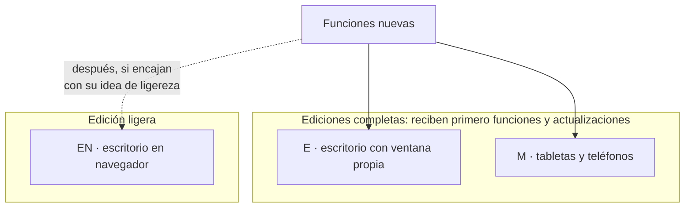
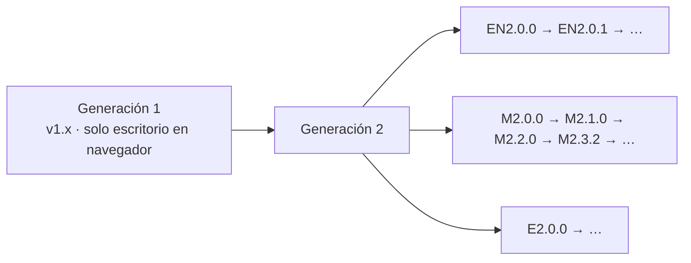

# Ediciones y versiones

MARC tiene **tres ediciones**. Todas leen las mismas wikis, comparten el formato `.marc` y exportan a PDF y Word; cambian en **dónde corren** y en **para qué están pensadas**.

| | **EN** · escritorio en navegador | **E** · escritorio con ventana propia | **M** · móvil |
|---|---|---|---|
| Qué es | Un servicio pequeño en tu equipo; la wiki se ve en tu navegador | Una aplicación de escritorio completa, con la interfaz de MARC en su propia ventana | La aplicación para tabletas y teléfonos |
| Dónde corre | Windows y Linux | Windows y Linux | Android 8 o superior |
| Pensada para | Leer y consultar **ligero**, sin tener una aplicación pesada abierta | Trabajar a fondo con tus wikis en el escritorio | Llevarte tus wikis, leerlas sin conexión, editarlas y consultarlas con IA |
| Funciones nuevas | Las recibe **después**, y solo las que encajan con su idea de ligereza | **Primero** | **Primero** |
| Estado | Disponible: `EN2.0.0` | Disponible: `E2.0.0` | Disponible: `M2.3.2` |

## Por qué existe cada una

### EN — la ligera

MARC nació como **EN**, con una idea: que fuera **ligero** y que no tuvieras que tener todo abierto. EN corre como un servicio pequeño en tu equipo y la wiki se ve en el navegador que ya usas, en una pestaña más. Así seguirá: EN es la opción para consultar tus wikis sin cargar una aplicación completa.

Por esa misma idea, EN recibe las funciones nuevas **después** que E y M, y solo las que no la hacen pesada.

### E — el escritorio completo

**E** lleva al escritorio la misma interfaz de MARC móvil, en su propia ventana: barra lateral, lector, búsqueda, edición visual, publicar con Git, historial y trabajo en equipo, notas, lectura cómoda, visor de archivos, asistente de IA y exportación. Junto con M es una edición **completa**: las funciones y actualizaciones llegan **primero** a ellas.

E es una versión **estable** (`E2.0.0`). Abre los `.marc` y `.md` con doble clic y mantiene **una sola ventana**: si ya está abierta, el archivo se abre en ella. Está previsto que en Windows puedas elegir al instalar qué interfaz quieres: **E** (ventana propia) o **EN** (en el navegador). Todo lo que trae está en [[14 Novedades]].

### M — el móvil

**M** es MARC para tabletas y teléfonos Android: tus wikis sin conexión, edición visual con respaldos, Git completo (publicar y actualizar sin instalar nada más), lectura cómoda con lector de voz, visor flotante, el asistente de IA y la carpeta MARC en tu almacenamiento. Igual que E, recibe **primero** las funciones nuevas. Ver [[08 MARC en tabletas y teléfonos]].

## Cómo conseguir cada una

| Edición | Hoy | Más adelante |
|---|---|---|
| **EN** | Instalador para Windows (`.exe`) y Linux (`.deb`), entregado directamente por el autor (ver [[12 Créditos]]) | — |
| **M** | Archivo de instalación de Android (`.apk`), entregado directamente por el autor | Se busca publicarla en **Google Play** y **AppGallery** |
| **E** | Entregada directamente por el autor, para Windows y Linux | Canal de distribución por definir |

> [!info] Una sola documentación para las tres
> Esta documentación es la misma para todas las ediciones y se actualiza sola en cada una desde su repositorio. Cuando una página habla de una edición en particular, lo indica.

## Versiones

Cada versión lleva la **letra de su edición** seguida de su número:

| Edición | Ejemplo |
|---|---|
| EN | `EN2.0.0` |
| E | `E2.0.0` |
| M | `M2.3.2` |

El número tiene tres partes: **mayor . menor . parche**.

- **Mayor:** es **el mismo en todas las ediciones**: marca la generación de MARC y cambia en todas a la vez.
- **Menor y parche:** son propios de cada edición, porque cada una recibe sus propias mejoras y correcciones.

Por ejemplo, `M2.3.2` y `EN2.0.7` son de la misma generación (la 2): M ya recibió más funciones, como corresponde a una edición completa.

### Por qué estamos en la 2

La generación 1 (`v1.x`) era solo el escritorio en navegador. La **generación 2** llegó con MARC móvil, el formato `.marc`, la exportación a PDF y Word y el asistente de IA: MARC dejó de ser solo un lector de escritorio y se convirtió en una familia de ediciones.

### Dónde ver tu versión

- **EN:** Más opciones → **Acerca de MARC**.
- **E** y **M:** **Ajustes → Acerca de**.

Qué trajo cada versión: [[14 Novedades]].

> [!info] El formato .marc tiene su propia versión
> Los archivos `.marc` llevan dentro la versión de su **formato** (hoy `1.0.0`), independiente de la edición. Un `.marc` creado en cualquier edición se abre en las demás, mientras compartan la versión mayor del formato.
