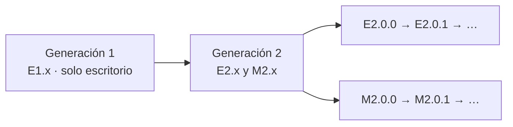

# Versiones

Cada versión de MARC lleva una **letra de plataforma** seguida de su número:

| Letra | Aplicación | Ejemplo |
|---|---|---|
| **E** | MARC de escritorio (Windows y Linux) | `E2.0.0` |
| **M** | MARC móvil (tabletas y teléfonos Android) | `M2.0.0` |

## Cómo se numeran

El número tiene tres partes: **mayor . menor . parche**.

- **Mayor:** es **el mismo en las dos aplicaciones**. Cambia cuando MARC cambia de concepto o de alcance, y entonces cambia en ambas a la vez.
- **Menor y parche:** pueden ser distintos en cada aplicación, porque cada una recibe sus propias mejoras y correcciones pequeñas.

Por ejemplo, `E2.1.4` y `M2.0.7` son de la misma generación (la 2) aunque cada una lleve sus propios ajustes.

## Por qué estamos en la 2

La generación 1 (`v1.x`) era solo la aplicación de escritorio. La **generación 2** llegó con MARC móvil, el formato `.marc`, la exportación a PDF y Word y el asistente de IA: MARC dejó de ser solo un lector de escritorio.

## Dónde ver tu versión

- **Escritorio:** Más opciones → **Acerca de MARC**.
- **Móvil:** **Ajustes → Acerca de**.

> [!info] El formato .marc tiene su propia versión
> Los archivos `.marc` llevan dentro la versión de su **formato** (hoy `1.0.0`), independiente de la versión de la aplicación. Un `.marc` creado en el escritorio se abre en el móvil y al revés, mientras compartan la versión mayor del formato.
