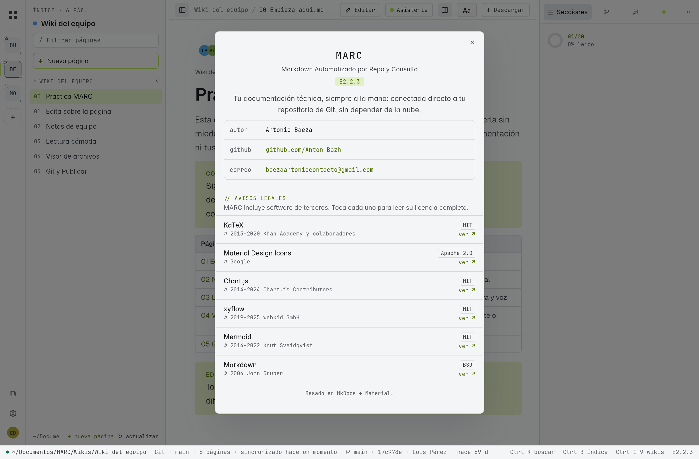
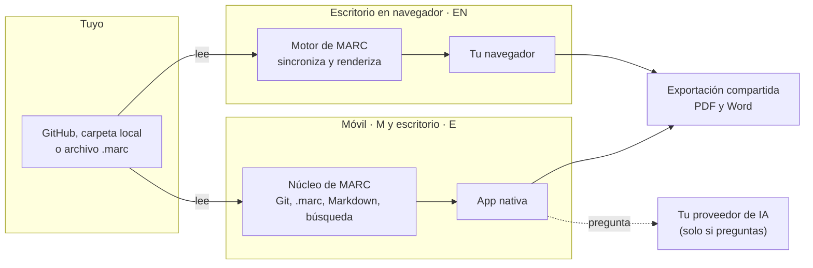

# Créditos

## Acerca de MARC

**MARC** — *Markdown Automatizado por Repo y Consulta* — nació con otro nombre de trabajo, **Wiki Desktop Client**, mientras la idea todavía se estaba probando: leer la documentación técnica de un equipo directo desde su repositorio de Git, sin nube, sin plataforma, sin fricción. El nombre cambió; la idea y la arquitectura descentralizada detrás — ver [[00 Portada|Portada]] — se mantienen igual desde el primer commit. Nació **ligero**, para consultar tus wikis sin tener una aplicación pesada abierta: esa edición sigue viva como **EN**. Con la **generación 2** MARC se convirtió en una familia de ediciones —EN (escritorio en navegador), E (escritorio con ventana propia) y M (móvil)— con formato portable, exportación a PDF y Word, asistente de IA y, en E y M, edición visual, Git completo, trabajo en equipo y lectura accesible.

`EN2.0.1` · `E2.2.3` · `M2.7.3` — ver [[10 Ediciones y versiones]] y [[14 Novedades]]

Los avisos legales de todo el software de terceros están en **Acerca de** (Ajustes → Acerca de en E y M); cada uno abre su licencia completa.



## Arquitectura, a grandes rasgos

MARC corre **100% en tu equipo o tableta**: no hay ningún servidor de MARC en internet al que tu documentación viaje. En el escritorio, un proceso local lee tu repositorio, carpeta o `.marc` y te sirve la wiki en tu propio navegador. En el móvil y en el escritorio con ventana propia (E), una aplicación nativa hace lo mismo con el **núcleo** de MARC (compartido por las dos), y comparte con EN el formato `.marc` y los motores de PDF y Word.



> [!info] Por qué no hay más detalle que este
> Esta página nombra las tecnologías con las que está construido MARC porque no es ningún secreto — son herramientas públicas, cualquiera puede instalarlas. Lo que no vas a encontrar aquí es un mapa de cómo se combinan por dentro: eso no le sirve a alguien que solo quiere *usar* MARC, y una wiki de usuario no es el lugar para exponerlo.

## Stack técnico

| | Capa | Herramienta |
|---|---|---|
| :simple-python: | Motor y empaquetado | [Python](https://www.python.org/), autocontenido en la app instalada — no necesitas tener Python instalado en tu equipo |
| :simple-fastapi: | Servidor local | [FastAPI](https://fastapi.tiangolo.com/) sobre [Uvicorn](https://www.uvicorn.org/) |
| :simple-materialformkdocs: | Traducción de Markdown → HTML | [MkDocs](https://www.mkdocs.org/) + [Material for MkDocs](https://squidfunk.github.io/mkdocs-material/) |
| :simple-git: | Clonado y sincronización de repos | [pygit2](https://www.pygit2.org/) (libgit2), sin depender de `git` instalado en el sistema |
| :material-key-variant: | Almacenamiento seguro de tokens | [`keyring`](https://pypi.org/project/keyring/), sobre el llavero nativo del sistema operativo |
| :simple-mermaid: | Diagramas fijos | [Mermaid](https://mermaid.js.org/) |
| :simple-react: | Diagramas arrastrables | [React Flow](https://reactflow.dev/) |
| :simple-chartdotjs: | Gráficas | [Chart.js](https://www.chartjs.org/) |
| :simple-latex: | Fórmulas matemáticas | [KaTeX](https://katex.org/) |
| :simple-obsidian: | Wikilinks, transclusión y callouts estilo Obsidian | [mkdocs-obsidian-links](https://pypi.org/project/mkdocs-obsidian-links/), [mkdocs-embed-file-plugins](https://pypi.org/project/mkdocs-embed-file-plugins/), [mkdocs-callouts](https://pypi.org/project/mkdocs-callouts/) |
| :simple-typescript: | Herramientas visuales del lado del navegador | [TypeScript](https://www.typescriptlang.org/), compilado con [esbuild](https://esbuild.github.io/) |
| :material-package-variant-closed: | Instalador de escritorio | NSIS en Windows, `.deb` en Linux — ambos empaquetan Python y todo lo anterior, sin dependencias que instalar aparte |
| :material-file-pdf-box: | Exportación a PDF (escritorio y móvil) | [Typst](https://typst.app/) compilado a WebAssembly ([typst.ts](https://github.com/Myriad-Dreamin/typst.ts)) y [MathJax](https://www.mathjax.org/) para las fórmulas |
| :material-file-word-box: | Exportación a Word (escritorio y móvil) | [docx](https://docx.js.org/) (MIT): documentos de Word, gráficas nativas y ecuaciones de Word |
| :simple-android: | MARC móvil | [Kotlin](https://kotlinlang.org/) y [Jetpack Compose](https://developer.android.com/compose) |
| :simple-rust: | Núcleo de MARC móvil | [Rust](https://www.rust-lang.org/): [comrak](https://github.com/kivikakk/comrak) (Markdown), [gix](https://github.com/GitoxideLabs/gitoxide) (Git), [zip](https://github.com/zip-rs/zip2) (formato `.marc`), unidos a la app con [UniFFI](https://github.com/mozilla/uniffi-rs) |
| :material-shield-key-outline: | Claves en el móvil | Almacén seguro de Android (Keystore), cifrado AES-GCM |
| :material-monitor: | MARC E (escritorio con ventana propia) | [Compose Multiplatform](https://www.jetbrains.com/compose-multiplatform/) (interfaz compartida con M), [JetBrains Runtime](https://github.com/JetBrains/JetBrainsRuntime) con [JCEF](https://github.com/chromiumembedded/java-cef) (Chromium integrado para gráficas, PDF y el visor) y [JNA](https://github.com/java-native-access/jna) para el llavero del sistema |
| :simple-git: | Publicar, unir y actualizar (E y M) | [libgit2](https://libgit2.org/) mediante [git2-rs](https://github.com/rust-lang/git2-rs), con [OpenSSL](https://www.openssl.org/) para HTTPS: la tableta hace Git completo sin instalar nada |
| :simple-github: | Cuenta de GitHub | Inicio de sesión por código de dispositivo de GitHub (*device flow*): MARC nunca ve tu contraseña |
| :material-format-font: | Tipografías de lectura | [Lexend](https://www.lexend.com/) y [Comic Neue](https://comicneue.com/) (SIL OFL), [Arimo](https://github.com/googlefonts/Arimo) (Apache 2.0) y [DejaVu Sans](https://dejavu-fonts.github.io/) (licencia libre de Bitstream Vera); sus licencias van dentro de la app |
| :material-account-voice: | Lector de voz (M) | El motor de voz **del sistema** (Android TextToSpeech). MARC no incluye voces: usa el motor del dispositivo (en Huawei, el suyo con el modelo de voz descargado); como alternativa, [SherpaTTS](https://github.com/woheller69/ttsEngine) (aplicación aparte, de código abierto) |

Todas las librerías de terceros están vendorizadas — nada se carga desde un CDN — para que la wiki funcione completamente sin conexión una vez sincronizada. Casi todas usan licencias permisivas (MIT, Apache 2.0, BSD, ISC o Zlib); las tipografías usan la SIL Open Font License, libgit2 la GPL 2 con excepción de enlace y el JetBrains Runtime la GPL 2 con *Classpath Exception*, que permiten incluirlas en MARC sin cambiar su licencia. Cada compilación del motor de Word verifica las licencias de sus dependencias, y **Ajustes → Acerca de** (E y M) muestra cada licencia completa.

## Creado por Antonio Baeza

- GitHub: [github.com/Anton-Bazh](https://github.com/Anton-Bazh)
- Correo: [baezaantoniocontacto@gmail.com](mailto:baezaantoniocontacto@gmail.com)

```
          .                                                      .
        .n                   .                 .                  n.
  .   .dP                  dP                   9b                 9b.    .
 4    qXb         .       dX                     Xb       .        dXp     t
dX.    9Xb      .dXb    __                         __    dXb.     dXP     .Xb
9XXb._       _.dXXXXb dXXXXbo.                 .odXXXXb dXXXXb._       _.dXXP
 9XXXXXXXXXXXXXXXXXXXVXXXXXXXXOo.           .oOXXXXXXXXVXXXXXXXXXXXXXXXXXXXP
  `9XXXXXXXXXXXXXXXXXXXXX'~   ~`OOO8b   d8OOO'~   ~`XXXXXXXXXXXXXXXXXXXXXP'
    `9XXXXXXXXXXXP' `9XX'   DIE    `98v8P'  HUMAN   `XXP' `9XXXXXXXXXXXP'
        ~~~~~~~       9X.          .db|db.          .XP       ~~~~~~~
                        )b.  .dbo.dP'`v'`9b.odb.  .dX(
                      ,dXXXXXXXXXXXb     dXXXXXXXXXXXb.
                     dXXXXXXXXXXXP'   .   `9XXXXXXXXXXXb
                    dXXXXXXXXXXXXb   d|b   dXXXXXXXXXXXXb
                    9XXb'   `XXXXXb.dX|Xb.dXXXXX'   `dXXP
                     `'      9XXXXXX(   )XXXXXXP      `'
                              XXXX X.`v'.X XXXX
                              XP^X'`b   d'`X^XX
                              X. 9  `   '  P )X
                              `b  `       '  d'
                               `             '

           mmmmmm        mmm    mmmmm    mmmmmmmm      mmm
           ##""""##     m###   #""""##m  """""###     m###
     mmm#  ##    ##    #" ##        m##      ##"     #" ##   #mmm
 mm#"""    #######   m#"  ##     #####     m##"    m#"  ##     """#mm
 ""#mmm    ##    ##  ########       "##   m##      ########    mmm#""
     """#  ##mmmm##       ##   #mmmm##"  ###mmmmm       ##   #"""
           """""""        ""    """""    """"""""       ""
```
