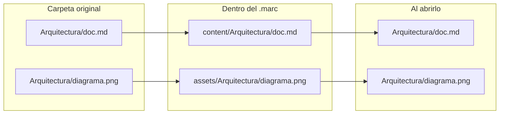

# Especificación del formato .marc

**Versión del formato: `1.0.0`**

Esta es la especificación oficial del formato `.marc`. Es un **formato abierto**: cualquiera puede leer, crear y modificar archivos `.marc` con sus propias herramientas, sin necesitar MARC. Todas las ediciones de MARC (EN, M y la futura E) siguen esta misma especificación, así que un `.marc` creado en una se abre en las demás.

> [!tip] ¿Solo quieres usarlo?
> Para abrir, compartir o exportar un `.marc` desde MARC no necesitas nada de esta página: ver [[07 El formato .marc]]. Esta página es para quien quiera **crear o leer `.marc` por su cuenta** (scripts, integraciones, otras aplicaciones).

## 1. Un archivo ZIP

Un `.marc` es un **ZIP estándar** con otra extensión.

- Cambia `.marc` por `.zip` y cualquier programa de compresión lo abre, sin herramientas especiales.
- La compresión es **sin pérdida**: ningún archivo cambia, ninguna imagen pierde calidad.
- Admite archivos grandes (ZIP64).

## 2. Estructura

```text
mi-wiki.marc
├── manifest.json      la ficha del paquete; siempre el PRIMER elemento del ZIP
├── content/           los archivos Markdown (.md, .markdown)
└── assets/            todo lo demás (imágenes, PDF, datos…)
```

No puede haber nada más en la raíz.

### Árboles espejo

`content/` y `assets/` usan **las mismas rutas relativas** que la carpeta original. Al abrir el paquete, los dos árboles se **superponen** en una sola carpeta, y así los enlaces de tus documentos siguen funcionando **sin reescribir el Markdown**: cada `.md` queda byte a byte igual al original.



Una misma ruta no puede existir en los dos árboles.

## 3. `manifest.json`

Un objeto JSON en UTF-8:

| Campo | Tipo | Regla |
|---|---|---|
| `version_formato` | texto (`"1.0.0"`) | Versión de esta especificación. Un lector acepta cualquier `1.x.x` y rechaza otra versión mayor |
| `nombre_proyecto` | texto, no vacío | Nombre de la wiki |
| `tipo_origen` | `"git"` o `"local"` | De dónde salió el contenido |
| `repositorio_url` | texto o `null` | Obligatorio con `git` (sin usuario ni contraseña); `null` con `local` |
| `rama` | texto o `null` | Obligatorio con `git`; `null` con `local` |
| `ultimo_commit` | texto o `null` | Commit empaquetado (con `git`); `null` con `local` |
| `fecha_empaquetado` | texto, fecha ISO 8601 en UTC (`2026-10-06T12:00:00Z`) | Se actualiza cada vez que se reescribe el paquete |

Ejemplo de origen **local**:

```json
{
  "version_formato": "1.0.0",
  "nombre_proyecto": "Mi wiki",
  "tipo_origen": "local",
  "repositorio_url": null,
  "rama": null,
  "ultimo_commit": null,
  "fecha_empaquetado": "2026-10-06T12:00:00Z"
}
```

Ejemplo de origen **git**:

```json
{
  "version_formato": "1.0.0",
  "nombre_proyecto": "MARC-DOC",
  "tipo_origen": "git",
  "repositorio_url": "https://github.com/Anton-Bazh/MARC-DOC.git",
  "rama": "main",
  "ultimo_commit": "4d7cabb…",
  "fecha_empaquetado": "2026-10-06T12:00:00Z"
}
```

> [!danger] Nunca credenciales
> Ningún campo puede contener tokens (`ghp_…`, `github_pat_…`), llaves privadas (`-----BEGIN … PRIVATE KEY-----`) ni cabeceras `Bearer …`. Un `.marc` que los contenga **no es válido**: MARC se niega a crearlo y a abrirlo. Los tokens se guardan aparte, en el almacén seguro de cada sistema.

## 4. Reglas para crear un .marc

| Regla | Detalle |
|---|---|
| Orden | `manifest.json` es el **primer** elemento del ZIP |
| Markdown | Los `.md` y `.markdown` van en `content/`; todo lo demás, en `assets/`, con la misma ruta relativa |
| Rutas | Relativas, con `/` como separador, sin `..` ni rutas absolutas |
| Se excluyen siempre | Archivos y carpetas **ocultos** (empiezan con `.`: `.git`, `.obsidian`, `.env`…, que pueden guardar credenciales), **enlaces simbólicos** y **otros `.marc`** |
| Compresión | DEFLATE para todo, **excepto** formatos ya comprimidos, que se guardan sin recomprimir (método *stored*) para que sus bytes queden idénticos: `png jpg jpeg gif webp avif heic jxl pdf zip gz xz bz2 7z zst mp4 mov webm mkv mp3 ogg opus m4a flac woff woff2 docx xlsx pptx odt ods odp` |

> [!note] La compresión *stored* es una recomendación
> Un lector debe aceptar cualquier método estándar de ZIP. Guardar sin recomprimir los formatos de arriba solo evita gastar tiempo sin ganar espacio.

## 5. Reglas para leer un .marc

Un lector debe **validar el paquete completo antes de extraer un solo archivo**, y rechazarlo si:

| Caso | Por qué |
|---|---|
| Falta `manifest.json`, no es JSON válido o su `version_formato` es de otra versión mayor | El paquete no se puede interpretar |
| Contiene credenciales (§3) | Seguridad |
| Una ruta tiene `..`, es absoluta o empieza con una unidad (`C:`) | Evita escribir fuera de la carpeta de destino (*zip slip*) |
| Contiene enlaces simbólicos | Podrían apuntar fuera del paquete |
| Hay elementos fuera de `manifest.json`, `content/` y `assets/`, rutas duplicadas, o la misma ruta en ambos árboles | Estructura inválida |
| Más de **200 000** elementos, más de **64 GiB** descomprimidos, o un elemento de más de 1 MiB que se descomprime más de **200 veces** su tamaño | Protección contra "bombas de descompresión" |

Recomendación: extraer en una carpeta temporal y renombrarla al terminar, para no dejar nunca un árbol a medias.

## 6. Versiones del formato

`version_formato` sigue el esquema **mayor.menor.parche**:

- **Menor y parche:** cambios compatibles (campos opcionales nuevos, aclaraciones). Un lector `1.x` los acepta.
- **Mayor:** cambios incompatibles. Un lector debe rechazar con un mensaje claro un paquete de otra versión mayor.

La versión del formato es **independiente** de la versión de las ediciones de MARC (ver [[10 Ediciones y versiones]]).

## 7. Cómo aprovecharlo

### Crear un .marc con herramientas del sistema (Linux)

Desde la carpeta de tu wiki, con `zip` y `jq` instalados:

```bash
ORIGEN="$PWD"; SALIDA="$HOME/mi-wiki.marc"; TMP=$(mktemp -d)
mkdir -p "$TMP/content" "$TMP/assets"
# Markdown a content/, todo lo demás a assets/ (sin ocultos ni enlaces simbólicos)
find . -type f ! -path '*/.*' ! -name '*.marc' | while read -r f; do
  case "$f" in *.md|*.markdown) d="content" ;; *) d="assets" ;; esac
  mkdir -p "$TMP/$d/$(dirname "$f")" && cp "$f" "$TMP/$d/$f"
done
jq -n --arg n "$(basename "$ORIGEN")" --arg f "$(date -u +%Y-%m-%dT%H:%M:%SZ)" \
  '{version_formato:"1.0.0", nombre_proyecto:$n, tipo_origen:"local",
    repositorio_url:null, rama:null, ultimo_commit:null, fecha_empaquetado:$f}' > "$TMP/manifest.json"
cd "$TMP" && rm -f "$SALIDA" && zip -q -X "$SALIDA" manifest.json && zip -q -X -r "$SALIDA" content assets
rm -rf "$TMP"
```

El resultado se abre en cualquier edición de MARC.

### Leer un .marc desde un programa (Python)

Sin dependencias, solo la biblioteca estándar:

```python
import json, zipfile

with zipfile.ZipFile("mi-wiki.marc") as z:
    manifiesto = json.loads(z.read("manifest.json"))
    paginas = [n for n in z.namelist() if n.startswith("content/") and not n.endswith("/")]
    print(manifiesto["nombre_proyecto"], "·", len(paginas), "páginas")
    portada = z.read(paginas[0]).decode("utf-8")
```

> [!warning] Si vas a **extraer** un .marc ajeno
> Aplica primero las validaciones de §5. Leer el contenido en memoria (como arriba) es seguro; escribirlo en disco sin validar las rutas, no.

### Ideas de uso

| Uso | Cómo |
|---|---|
| Entregar documentación a un cliente | Un solo archivo que se abre sin conexión, con imágenes y adjuntos |
| Archivar versiones | Un `.marc` por entrega o por fecha; cada uno dice de qué commit salió |
| Generar desde integración continua | Empaquetar la wiki en cada versión de tu proyecto (receta de arriba) |
| Leerlo en otras herramientas | Es un ZIP con Markdown: cualquier visor de Markdown sirve tras extraerlo |
