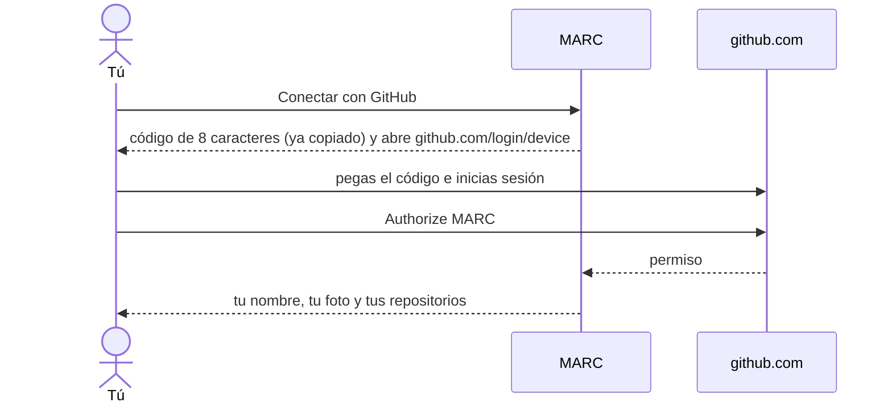
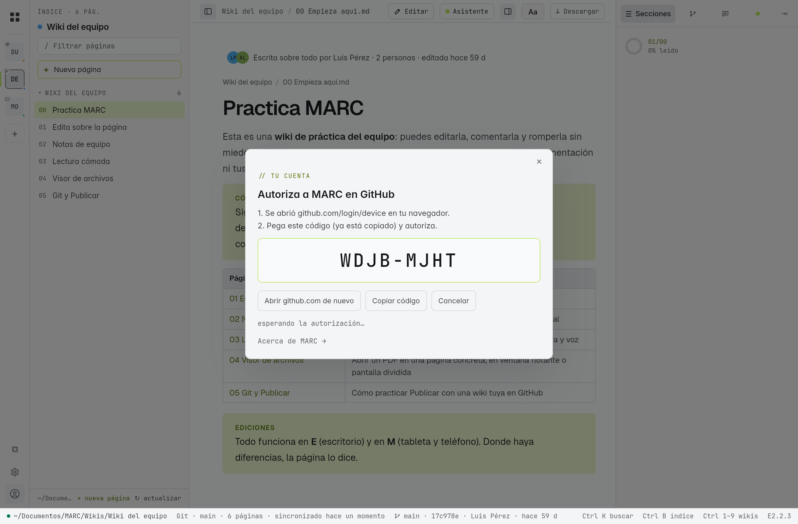
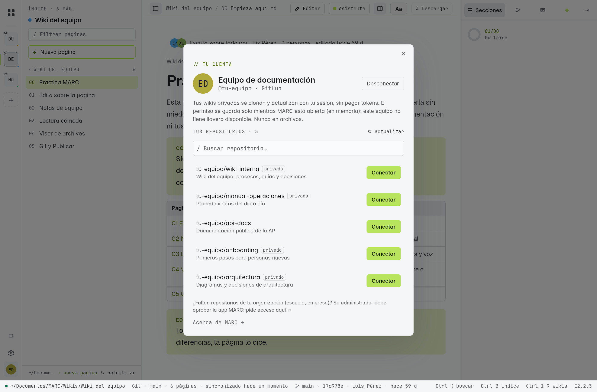

# Tu cuenta de GitHub

Con tu cuenta de GitHub conectada, MARC lista **tus repositorios** (también los privados) para conectarlos con un clic, publica tus cambios y tus notas sin pedirte tokens, y muestra quién escribe cada página con su foto. Está en **E** y en **M**.

> [!info] MARC sigue sin tener cuenta propia
> No hay "cuenta de MARC": te conectas con **tu** GitHub y la sesión vive solo en tu equipo. Sin cuenta, MARC funciona igual con carpetas, `.marc` y repositorios públicos.

## Iniciar sesión (unos 30 segundos)

| Edición | Dónde |
|---|---|
| **E** | Icono de cuenta, abajo en la barra lateral izquierda |
| **M** | Menú **⋯** (abajo en la barra lateral) → **Iniciar sesión con GitHub** |
| Ambas | **+ Conectar → Git →** «¿Usas GitHub? Conecta tu cuenta y elige tus repositorios» |

1. Pulsa **Conectar con GitHub**. MARC muestra un código de 8 caracteres, lo **copia** y abre `github.com/login/device` en tu navegador.
2. Pega el código, inicia sesión en GitHub si hace falta y pulsa **Authorize MARC**.
3. Vuelve a MARC: ya aparecen tu nombre, tu foto y tus repositorios.

> [!tip] Si ya usas `gh`
> En el escritorio, si tienes la herramienta `gh` de GitHub con sesión iniciada, MARC ofrece **entrar con un clic** usando esa sesión.

## Qué puedes hacer con la cuenta

| Con la cuenta | Página |
|---|---|
| Conectar tus repositorios (públicos y privados) desde una lista con buscador, con historial completo | [[01 Conectar tu primer repositorio]] |
| Publicar tus cambios y tus notas sin token | [[18 Publicar cambios (Git)]] |
| Ver la foto y la cuenta de quien escribió cada página; propuestas de cambio (*pull requests*) abiertas que tocan la página | [[16 Historial y trabajo en equipo]] |
| Que tus notas se publiquen también como *issues* | [[19 Notas de equipo]] |
| Publicar en GitHub una carpeta de tu equipo (E) | [[18 Publicar cambios (Git)]] |

## Repositorios de una organización

Si trabajas en una **organización** de GitHub (escuela, empresa), puede que sus repositorios **no aparezcan** en la lista: algunas organizaciones exigen que un administrador **apruebe** cada aplicación. Al final de tu lista de repositorios está el enlace **«pide acceso aquí»**, que abre la página de GitHub donde solicitas la aprobación de MARC. Cuando el administrador la apruebe, los repositorios aparecen solos.

## La sesión no se pierde

- Se guarda en el **llavero del sistema** (escritorio: el de GNOME/KDE en Linux, el Administrador de credenciales en Windows) o en el **almacén seguro de Android** (tableta). Nunca en archivos ni en un `.marc`.
- Al abrir MARC te ve conectado al instante. **Sin internet**, la sesión sigue guardada y MARC vuelve a comprobarla sola cuando hay conexión.
- Si revocas el acceso desde GitHub (Settings → Applications), MARC lo detecta, borra la sesión y te pide volver a conectar.

## Desconectar

En la hoja de tu cuenta, pulsa **Desconectar**: MARC borra la sesión del llavero. Tus wikis conectadas no se tocan.

## ¿Y los tokens?

Con la cuenta ya no hacen falta. Siguen sirviendo para **otros servidores** (GitLab, un servidor propio) o si prefieres no conectar tu cuenta: ver [[01 Conectar tu primer repositorio]].

> [!note] Para probarlo
> Conecta tu cuenta y crea una wiki de práctica en GitHub: [[22 Practica las funciones]].
