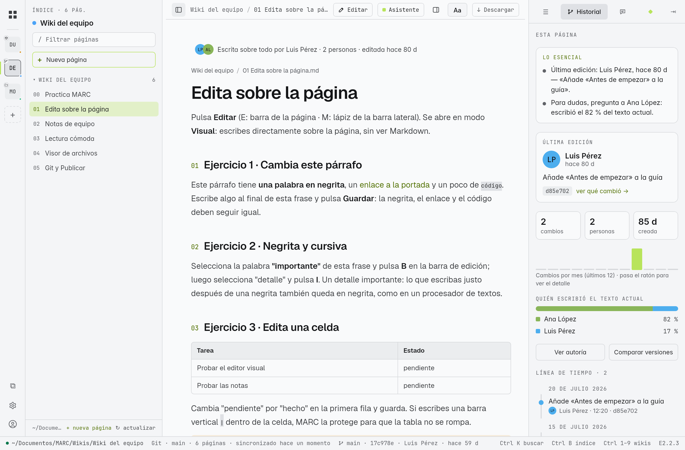
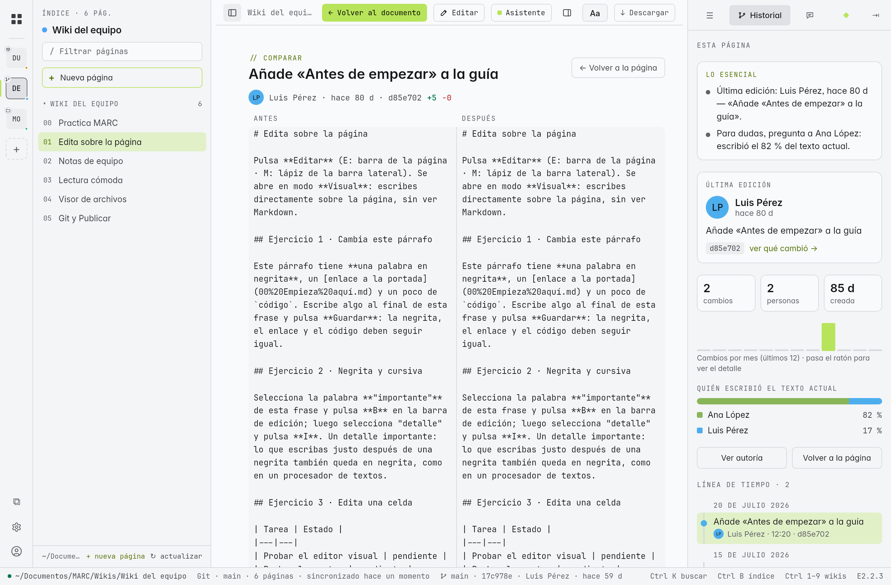
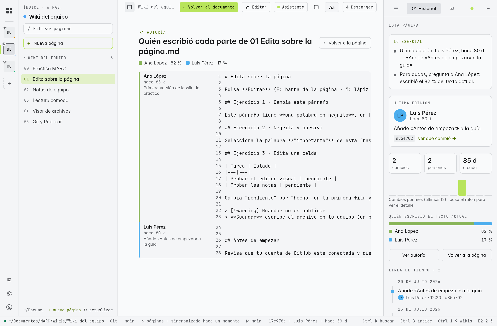
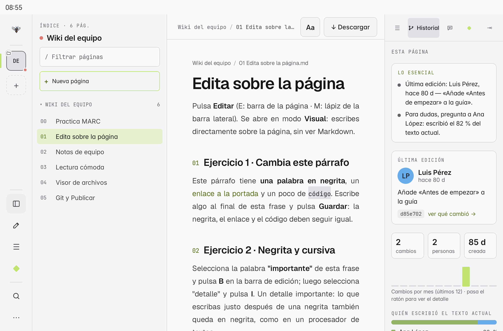
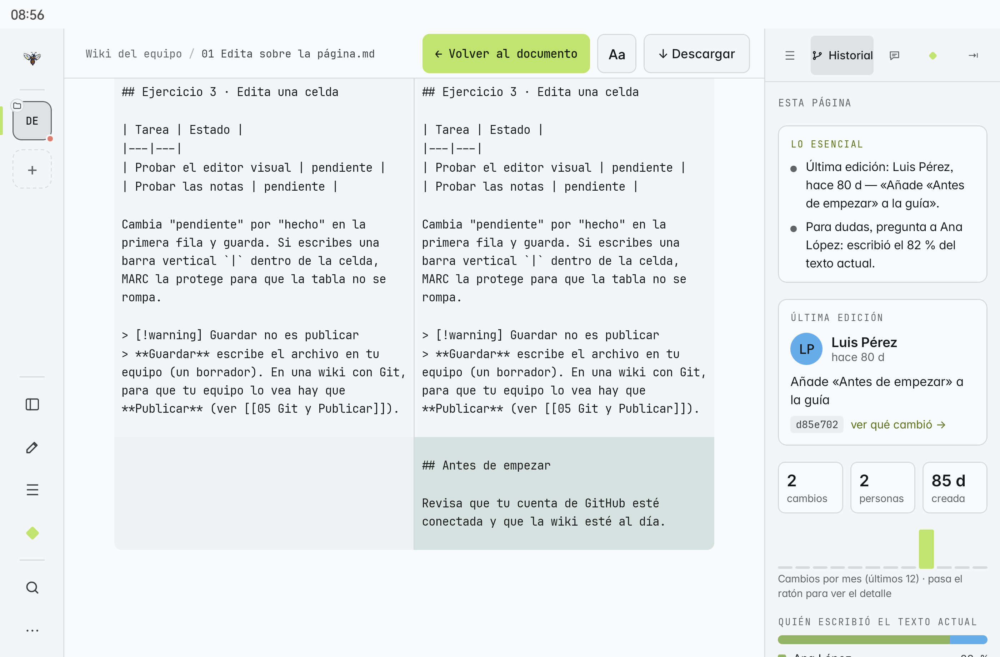
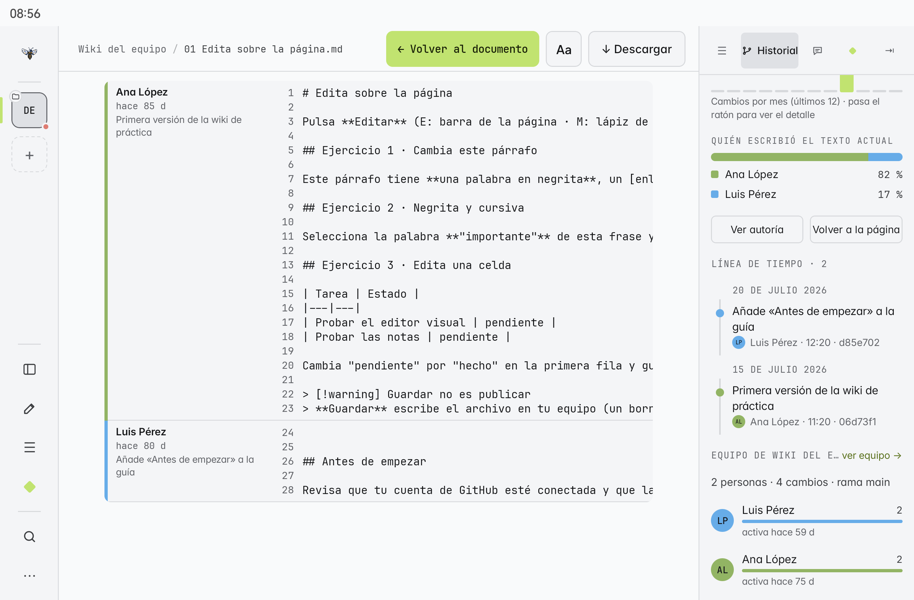
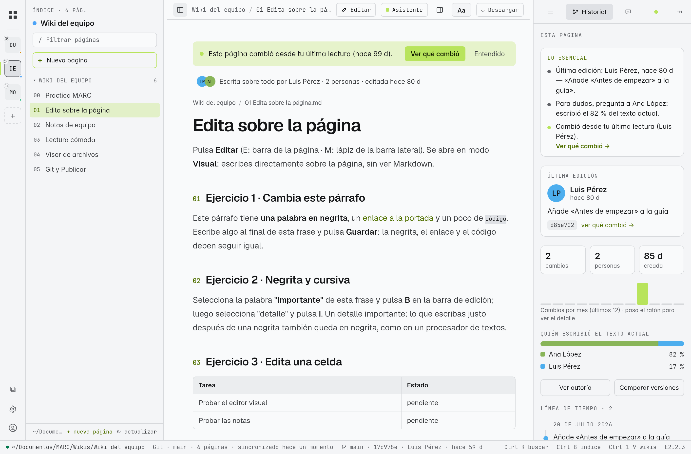
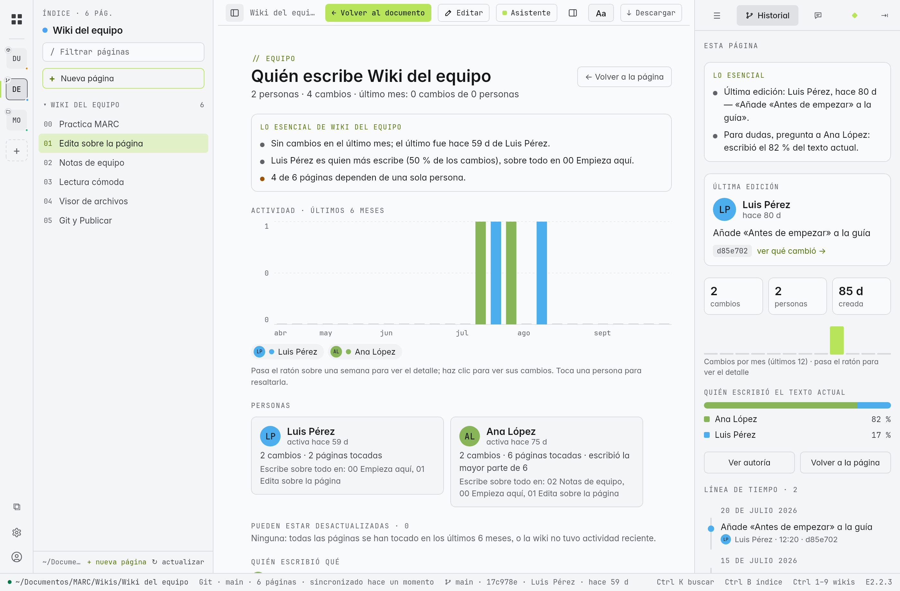
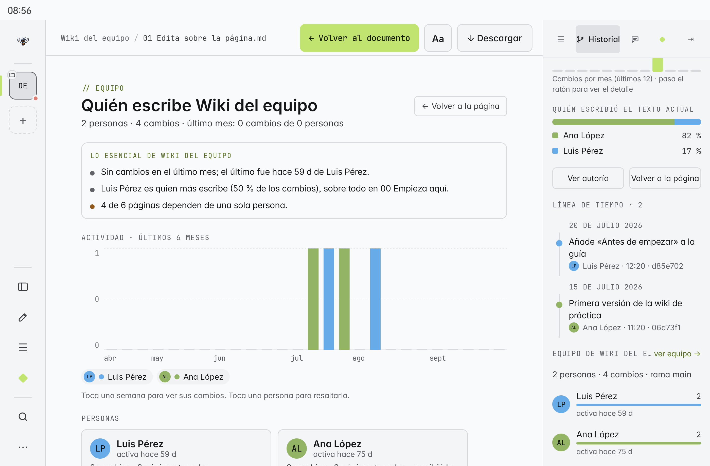

# Historial y trabajo en equipo

Cuando una wiki vive en **Git**, MARC te muestra quién la escribió, qué cambió y cuándo, sin salir de la página. Es para **colaborar** (a quién preguntar, qué cambió, qué falta), no para medir a nadie: no hay rankings ni productividad. Está en **E** y en **M**.

> [!info] Solo en wikis con Git
> Una carpeta sin Git o una wiki abierta desde un `.marc` no tiene historial: el `.marc` lleva el contenido, no la historia. El panel lo explica y, si tienes abierta la misma wiki con Git, te ofrece abrirla.

## La pestaña Historial

En el **panel derecho** (botón del panel, arriba a la derecha) elige **Historial**:

| Sección | Qué muestra |
|---|---|
| **Lo esencial** | En frases: la última edición, a quién preguntar (quien escribió más del texto actual), si solo una persona conoce la página, si parece desactualizada, si cambió desde tu última lectura y si hay propuestas de cambio abiertas |
| **Última edición** | Quién, cuándo, con qué mensaje y el commit; **ver qué cambió →** |
| Números | Cambios, personas y antigüedad de la página; gráfica de cambios por mes |
| **Quién escribió el texto actual** | Barra con el porcentaje de cada persona (autoría línea por línea) |
| **Ver autoría** | La página con cada parte marcada con su autor |
| **Comparar versiones** | Antes y después de cualquier cambio, lado a lado |
| **Línea de tiempo** | Todos los cambios de la página, por día |

En la tableta:

## Cambió desde tu última lectura

Si **otra persona** cambió una página desde la última vez que la leíste, verás:

- un **punto** junto a la página en el índice;
- arriba de la página: *"Esta página cambió desde tu última lectura"*, con **Ver qué cambió** (abre la comparación solo con lo nuevo) y **Entendido** (cierra el aviso).

Tus propios cambios **no** activan el aviso.

## Equipo y actividad

- **Equipo de esta wiki** (desde el Historial): quién trabaja la wiki, su actividad y quién conoce cada parte.
- **Actividad** (en el inicio): lo último que pasó en tus wikis con Git.
- La **barra de estado** (abajo, E) muestra la rama, el último commit, su autor y cuándo.

## En tiempo real

MARC vigila la wiki abierta: si llega un commit nuevo (por ejemplo, tras **↻ actualizar**) o alguien edita un `.md` con otro programa (Obsidian, un editor de código), la página y el Historial se actualizan solos, sin reiniciar.

## Traer historial

Las wikis que la tableta conectó **antes de M2.2.0** se clonaron solo con el último commit (para ahorrar espacio). Para ver toda su historia y poder publicar, abre el Historial y pulsa **Traer historial completo**: MARC baja la historia completa y reemplaza la copia (si no tienes cambios sin publicar). Las wikis que conectes desde ahora ya llegan con todo el historial.

## Con tu cuenta de GitHub

Con la [[15 Tu cuenta de GitHub|cuenta conectada]], el Historial muestra la **foto y la cuenta** de cada autor y las **propuestas de cambio abiertas** que tocan la página.

> [!note] Para probarlo
> Necesitas una wiki con Git y al menos dos cambios: crea una en GitHub desde MARC y edítala dos veces ([[22 Practica las funciones]]).
