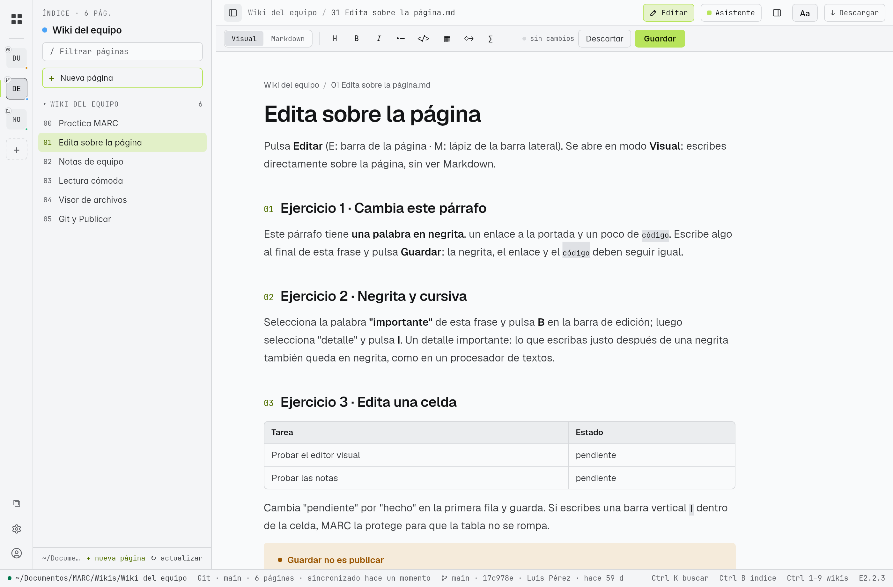
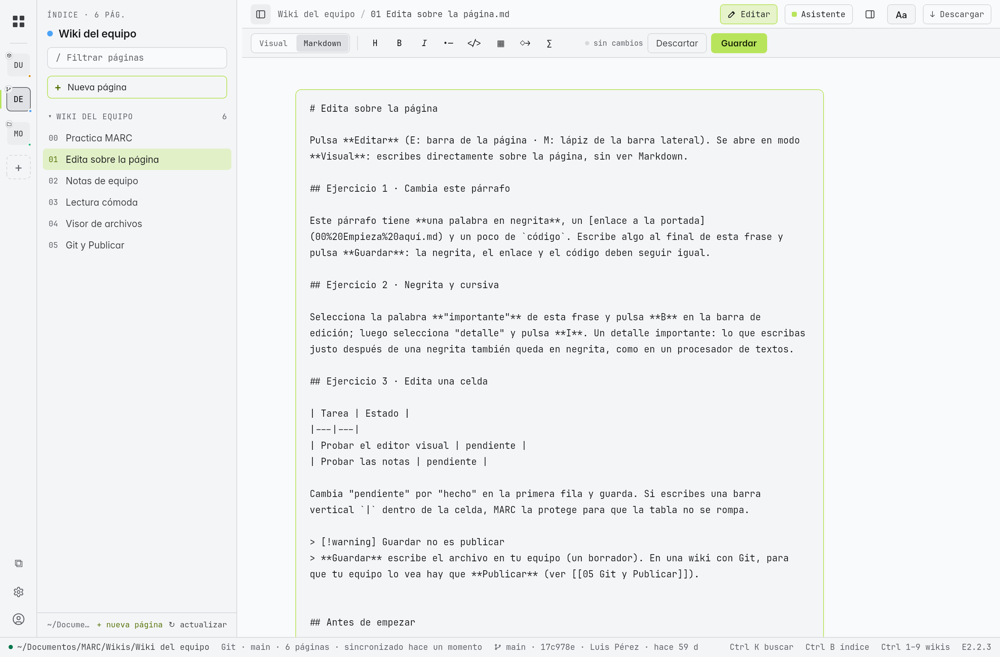
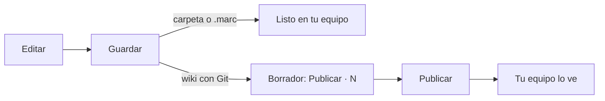

# Editar sobre la página

En **E** y **M** puedes escribir directamente sobre la página tal como se ve, sin ver Markdown, y MARC guarda el archivo `.md` **exacto**: solo cambia lo que tocaste. Los enlaces, el formato, las tablas y todo lo demás quedan como estaban.

> [!info] Dónde se edita
> Solo en wikis que son tuyas para escribir: carpetas, repositorios clonados y `.marc` abiertos. La **Documentación de uso** es de solo lectura; para practicar usa la [[22 Practica las funciones|wiki de práctica]].

## Entrar a editar

| Edición | Cómo |
|---|---|
| **E** | Botón **Editar** en la barra de la página |
| **M** | Lápiz en la barra lateral |

Arriba aparecen dos pestañas:

| Pestaña | Para qué |
|---|---|
| **Visual** (la de inicio) | Escribes sobre la página dibujada: párrafos, títulos, listas, citas, avisos (*callouts*) y **celdas de tablas** |
| **Markdown** | El texto fuente completo, para lo que Visual no edita: bloques de código, diagramas, gráficas, fórmulas, imágenes, encabezados de tabla, o cambios grandes de estructura |

Puedes pasar de una a otra sin perder lo escrito. De **Markdown** a **Visual** solo se vuelve después de **Guardar** o **Descartar** (MARC lo avisa: *"guarda o descarta los cambios de Markdown para volver a Visual"*), porque la página dibujada es la guardada.

## Negrita y cursiva

Selecciona texto y pulsa **B** (negrita) o **I** (cursiva) en la barra de edición. Funciona como en un procesador de textos:

- Lo que escribas **justo después** de una negrita también queda en negrita.
- Lo que escribas **justo antes** queda fuera.
- MARC nunca parte una entidad (`&amp;`, un enlace) al cerrar una marca.

## Celdas de tabla

Haz clic en una celda y escribe. Si escribes una barra vertical `|`, MARC la protege (`\|`) para que la tabla no se rompa. Las filas y columnas nuevas, y los encabezados, se editan en la pestaña Markdown.

## Insertar bloques

Los botones de insertar (aviso, tabla, diagrama, código…) ponen la plantilla del bloque **en Markdown**: MARC guarda primero lo que escribiste en Visual y cambia a la pestaña Markdown con el aviso *"bloque insertado como Markdown"*.

## Guardar no es publicar

- **Guardar** escribe el archivo en tu equipo. Mientras no guardes, la barra dice *"cambios sin guardar"*; **Descartar** vuelve a lo guardado.
- En una wiki con Git, lo guardado es un **borrador**: el botón **Publicar · N** cuenta tus cambios pendientes. Ver [[18 Publicar cambios (Git)]].
- En un `.marc`, Guardar actualiza el propio `.marc`.

## Si algo no casa

Si escribiste en Visual sobre algo que MARC no puede ubicar con seguridad en el Markdown (raro, por ejemplo HTML mezclado), **no lo adivina**: avisa *"no se pudo ubicar un cambio en el Markdown · revisa en la pestaña Markdown"* y te deja hacerlo ahí. Nunca escribe un cambio en el lugar equivocado.

> [!note] Para probarlo
> Página **01 Edita sobre la página** de la [[22 Practica las funciones|wiki de práctica]].
