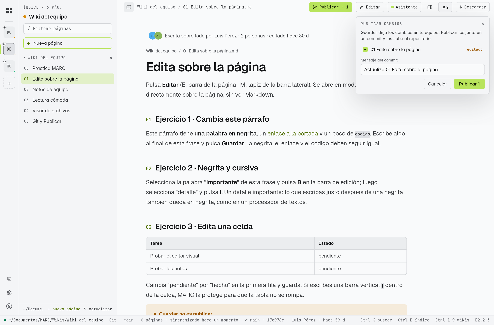
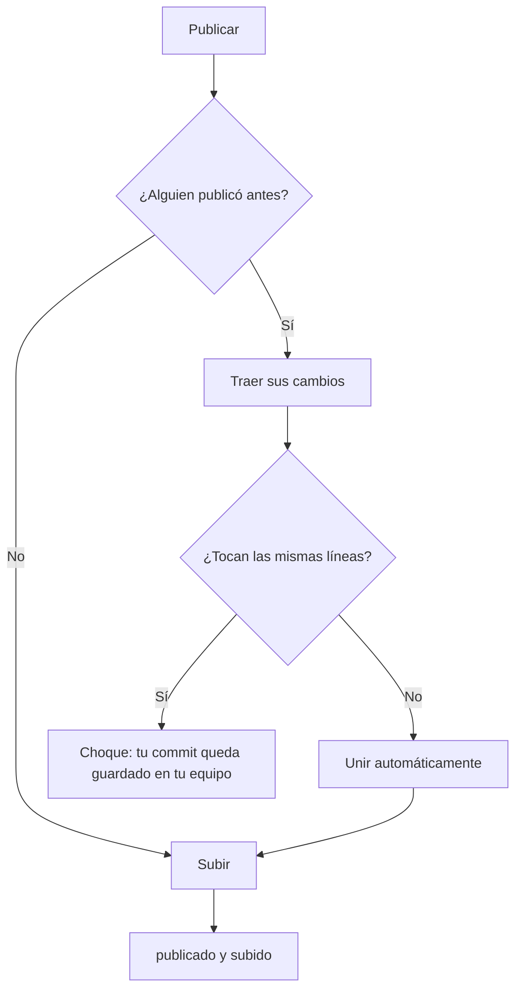
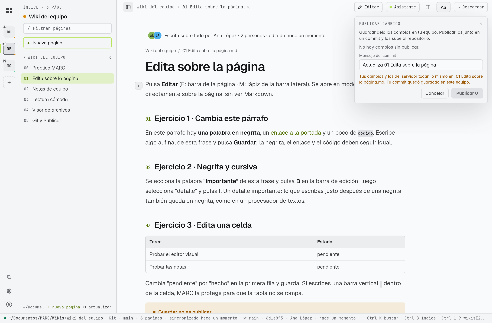

# Publicar cambios (Git)

MARC trabaja con Git como un editor de código: **Guardar** deja tus cambios en tu equipo como borrador, y **Publicar** los junta en **un solo commit** y los sube al servidor (GitHub u otro) para que tu equipo los vea. Está en **E** y en **M**; ninguna de las dos necesita tener `git` instalado para publicar.

> [!info] Git en dos líneas
> Un **repositorio** es una carpeta con historia. Un **commit** es una foto de los cambios con autor, fecha y mensaje. **Publicar** = hacer el commit y subirlo (*push*). **Actualizar** = traer los commits de los demás (*pull*).

## Publicar · N

Cuando guardas en una wiki con Git, en la barra aparece **Publicar · N**, donde N es el número de archivos cambiados (páginas y notas).

1. Pulsa **Publicar · N**. Se abre la ventana **Publicar cambios** con la lista de archivos (editado, agregado, borrado, renombrado) y las notas de equipo.
2. Desmarca lo que no quieras publicar todavía.
3. Revisa el **Mensaje del commit**. MARC propone uno a partir de lo que cambió, por ejemplo *"Actualiza 05 Backend y 02 Arquitectura · 2 notas"*; puedes cambiarlo.
4. Pulsa **Publicar**. Verás *"publicado y subido (a1b2c3d)"*.

| Mensaje | Qué pasó |
|---|---|
| **publicado y subido (hash)** | El commit ya está en el servidor |
| **publicado y subido (hash) · se unió con cambios de otra persona** | Alguien había publicado antes; MARC unió los dos trabajos sin perder nada y subió el resultado |
| **publicado en Git (hash) · esta wiki no tiene servidor** | Repositorio solo local: el commit queda en tu equipo |
| **No hay cambios sin publicar.** | Todo está publicado |

> [!tip] El autor del commit
> Con tu [[15 Tu cuenta de GitHub|cuenta de GitHub]] conectada, el commit sale con tu nombre de GitHub. Si no, con el nombre configurado en Git de ese equipo.

## Cuando dos personas cambian a la vez

- Si cambiaron **partes distintas** (otra página, otro párrafo), MARC **une** los dos trabajos con un commit de unión y publica. No tienes que hacer nada.
- Si cambiaron **las mismas líneas**, MARC no decide por ti: muestra *"Tus cambios y los del servidor tocan lo mismo en: archivo.md. Tu commit quedó guardado en este equipo."* **Nada se pierde**: tu commit está en tu equipo y el del servidor sigue en el servidor.

> [!warning] Resolver un choque
> Habla con la otra persona para decidir qué texto queda. Luego, en un equipo de escritorio, abre la carpeta de la wiki con una herramienta de Git (por ejemplo VS Code, GitHub Desktop o `git pull` en una terminal), une los dos textos y súbelo. Después pulsa **↻ actualizar** en MARC. Las **notas de equipo nunca chocan**: cada nota es un archivo distinto.

## ↻ Actualizar

**↻ actualizar** (en la ficha o en el menú de la wiki) trae lo que publicó el equipo:

- Si no tienes cambios, la wiki avanza al último commit.
- Si tienes **borradores sin publicar**, se conservan: MARC los aparta, trae lo nuevo y los vuelve a poner. Si lo nuevo choca con tus borradores, no toca nada y te avisa.
- La página abierta y el Historial se actualizan solos ([[16 Historial y trabajo en equipo]]).

## Conectar y crear wikis con Git

| Quieres | Cómo | Página |
|---|---|---|
| Conectar un repositorio de GitHub | **+ Conectar → Git**, elige de tu lista (con cuenta) o pega la URL | [[01 Conectar tu primer repositorio]] |
| Elegir **dónde guardarlo** (E) | Al conectar, **Dónde guardarlo** propone una carpeta y puedes cambiarla | [[01 Conectar tu primer repositorio]] |
| Usar uno que **ya tenías clonado** (E) | **¿Ya lo tienes clonado?** → elige la carpeta; MARC lo usa tal cual, sin copiarlo | [[01 Conectar tu primer repositorio]] |
| Crear una wiki nueva en GitHub | **+ Conectar → Crear**, elige **GitHub** y si es privada | [[01 Conectar tu primer repositorio]] |
| Subir a GitHub una **carpeta** que ya tienes en MARC (E) | Abre la carpeta: el panel ofrece *"Esta carpeta no tiene servidor. Publícala en tu cuenta de GitHub…"* → **Publicar esta carpeta en GitHub**, con nombre y **Privado (solo tú y quien invites)** | — |

## En la tableta

La tableta trae su propio Git (la biblioteca libgit2), así que publica, une y actualiza igual que el escritorio:

- Las wikis se conectan con **todo el historial**. Las que se conectaron antes de M2.2.0 tienen solo el último commit: pulsa **Traer historial completo** en la pestaña Historial antes de publicar ([[16 Historial y trabajo en equipo]]).
- Para repositorios privados, inicia sesión desde **⋯ → Iniciar sesión con GitHub**.
- Si hay un choque, tu commit queda guardado en la tableta; resuélvelo desde un equipo de escritorio como se explica arriba, y luego pulsa ↻ actualizar en la tableta.

## Permisos y errores comunes

| Aviso | Qué hacer |
|---|---|
| *"El servidor pidió permiso: inicia sesión con GitHub o revisa el token de esta wiki."* | Conecta tu cuenta, o comprueba que tienes permiso de escritura en ese repositorio |
| *"Sin conexión con el servidor de Git"* | Revisa internet; tu commit queda guardado y puedes volver a publicar después |
| *"commit hecho aquí, pero no se pudo subir"* | El commit está en tu equipo; pulsa Publicar de nuevo cuando se resuelva |

> [!note] Para probarlo
> La página **05 Git y Publicar** de la [[22 Practica las funciones|wiki de práctica]] te guía para crear una wiki tuya en GitHub y probar Publicar, unir y actualizar sin tocar nada importante.
