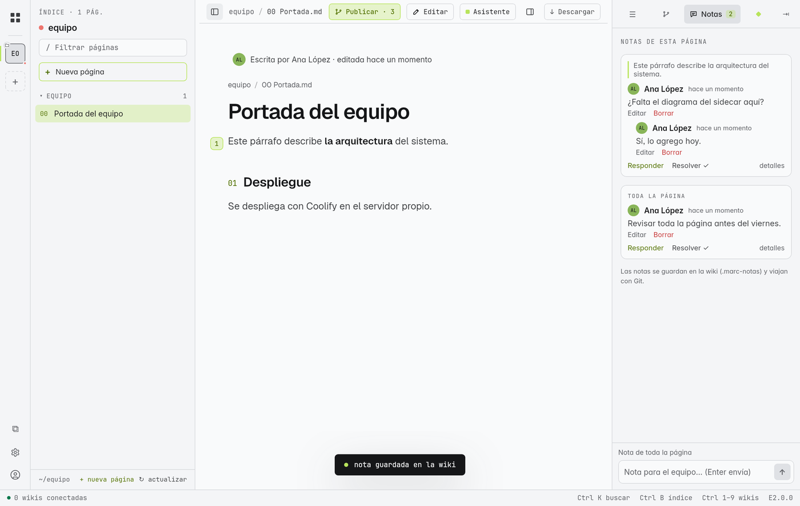

# Notas de equipo

Las notas son **comentarios pegados a un párrafo**, como en un documento compartido: preguntas, pendientes, revisiones. No cambian el texto de la página. Están en **E** y en **M**.

## Dónde viven

| Wiki | Dónde se guardan | Quién las ve |
|---|---|---|
| Carpeta o `.marc` | Dentro de la wiki, carpeta `.marc-notas` | Quien abra esa carpeta |
| Con Git | En `.marc-notas`, y viajan con **Publicar** | Todo el equipo al ↻ actualizar |
| En GitHub con tu cuenta | Además, como ***issues*** del repositorio (opcional) | También quien use github.com |

> [!info] Nunca chocan
> Cada nota y cada respuesta es un archivo propio, así que dos personas comentando a la vez nunca generan un choque al publicar.

## Dejar una nota

- **Sobre un párrafo (E):** pasa el ratón por el párrafo; a la izquierda aparece un **+**. Púlsalo, escribe y pulsa **Enter**.
- **Sobre toda la página (E y M):** abre la pestaña **Notas** del panel derecho y escribe en *"Nota para el equipo… (Enter envía)"*.

Las notas de un párrafo muestran una marca en el margen; al pulsarla se abre la nota.

## Conversar, resolver y reabrir

| Acción | Cómo | Queda en el historial |
|---|---|---|
| **Responder** | Botón Responder, escribe, **Enter** | La respuesta, con autor y fecha |
| **Resolver ✓** | Cuando está atendida | *"resolvió la nota"*, quién y cuándo; pasa a "resueltas" |
| **Reabrir** | En una resuelta | *"reabrió la nota"* |
| **detalles** | En cualquier nota | Fechas exactas y **Guardada en:** (archivo) |
| **Editar** / **Borrar** | Solo en **tus** notas | *"nota editada"* (marcada como editada) · borrar quita la nota y su hilo |

Una nota que llegó de otra persona desde tu última visita aparece como **nueva**.

## Notas en GitHub

Si la wiki está en GitHub y conectaste tu [[15 Tu cuenta de GitHub|cuenta]], al escribir una nota puedes marcar **publicar también en GitHub**:

- La nota se crea como *issue* en el repositorio, con la página y el párrafo.
- Lo que el equipo responda en github.com aparece en MARC (*"sincronizando…"*), y tus respuestas desde MARC llegan allí (*"respuesta guardada y enviada a GitHub"*).
- Resolver en MARC cierra el *issue*; **editar en GitHub ↗** lo abre en el navegador.
- Sin conexión, la nota se guarda en la wiki y se envía después.

## Publicar las notas

En una wiki con Git, las notas cuentan en **Publicar · N** (*"1 nota de equipo"*) y van en el mismo commit que tus cambios, con un mensaje como *"nota en 05 Backend"*. Ver [[18 Publicar cambios (Git)]].

> [!note] En la tableta
> En M las notas se escriben desde la pestaña **Notas** (toda la página); el **+** del margen para comentar un párrafo concreto necesita ratón y llegará a la pantalla táctil más adelante. Responder, resolver y leer funcionan igual.

> [!note] Para probarlo
> Página **02 Notas de equipo** de la [[22 Practica las funciones|wiki de práctica]]. La Documentación de uso es de solo lectura: ahí no se dejan notas.
