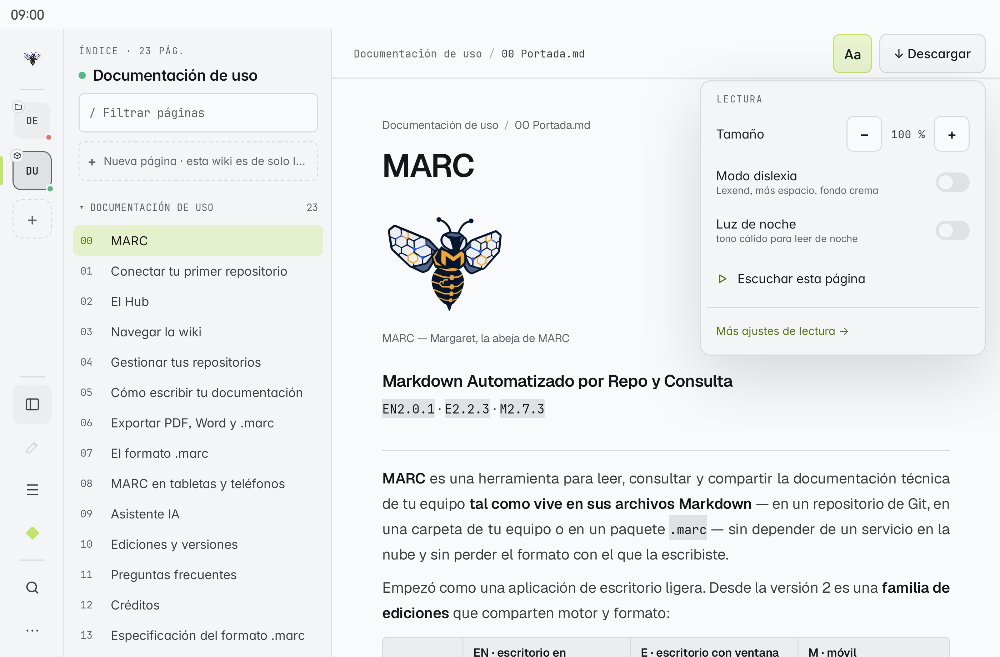
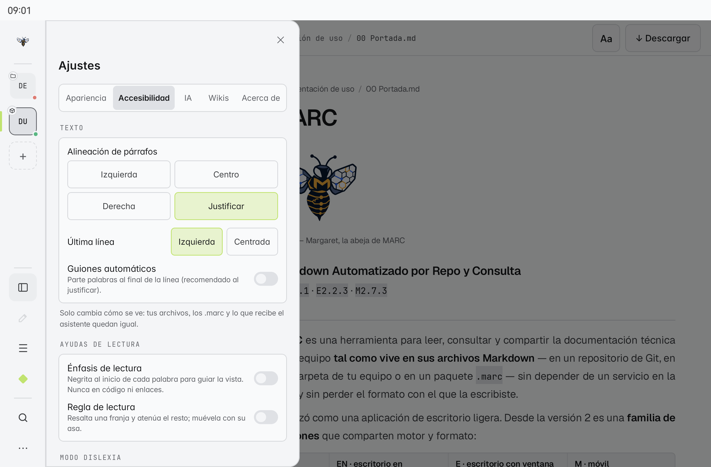
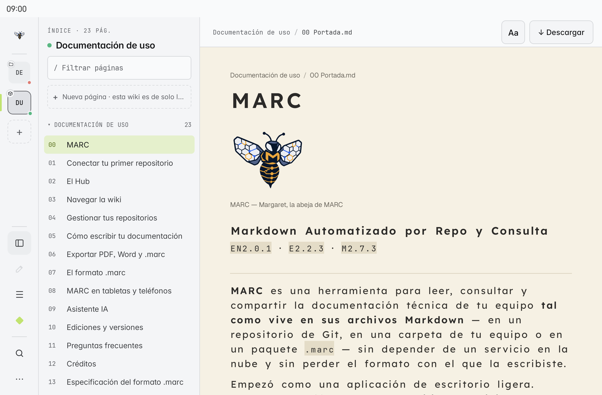
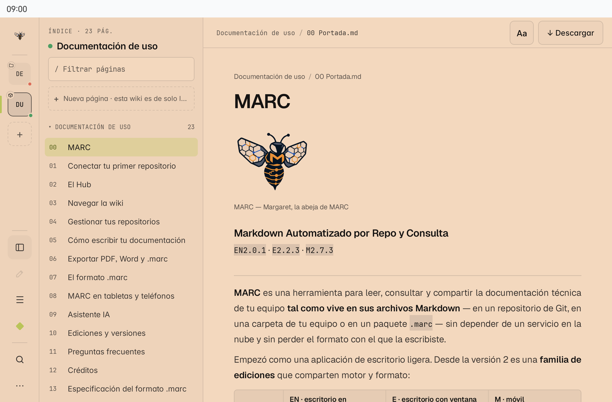
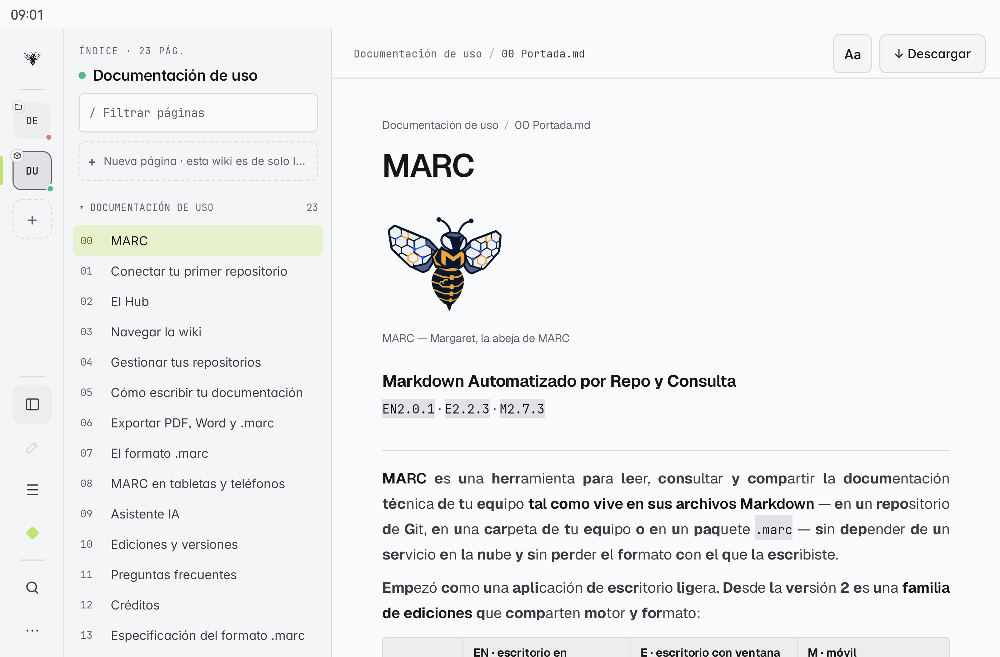
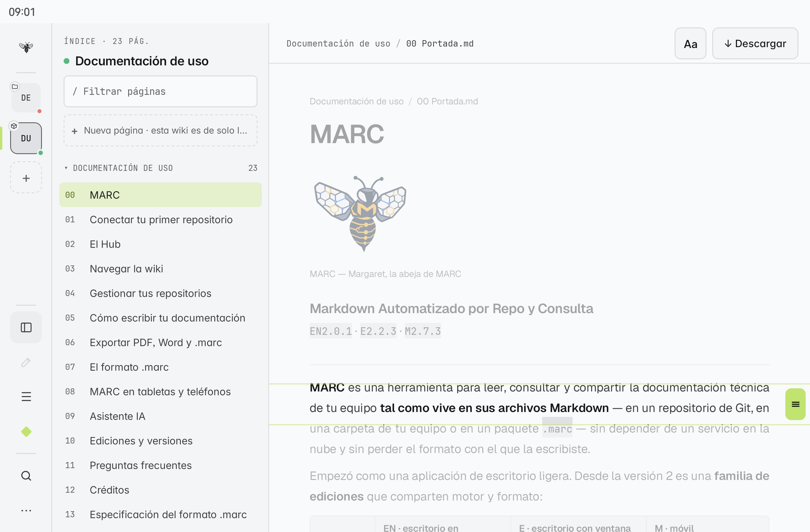
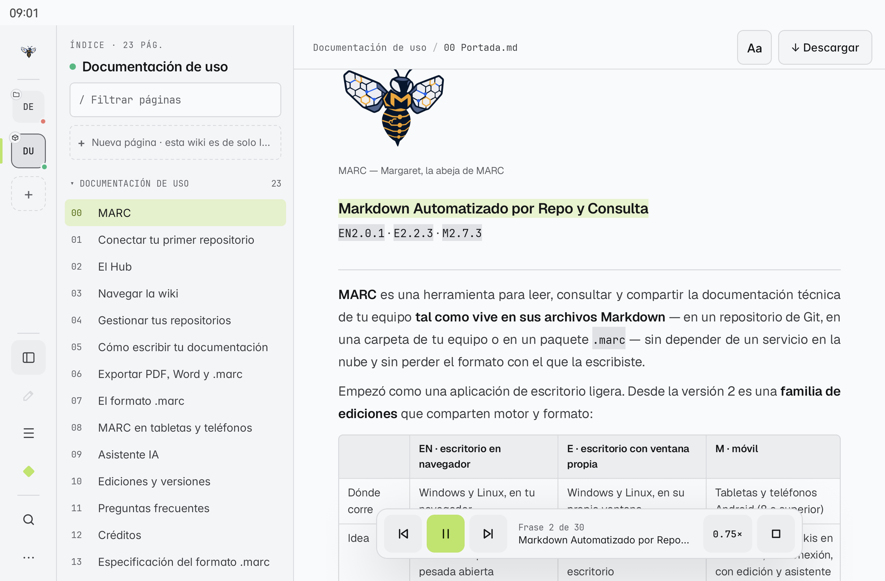
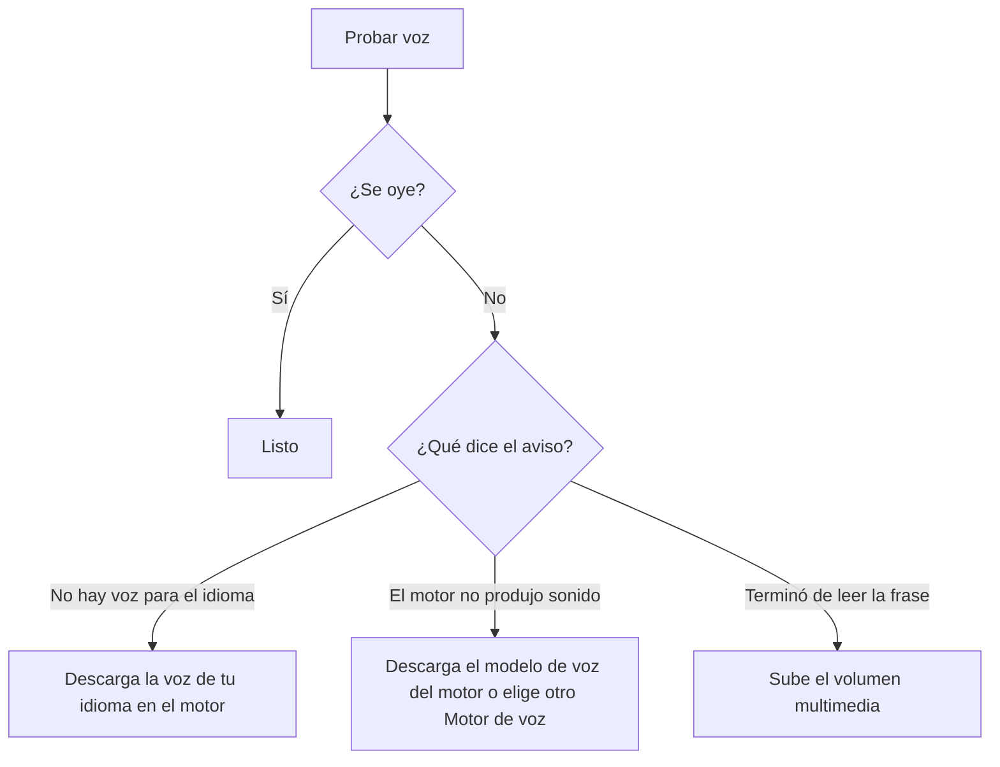
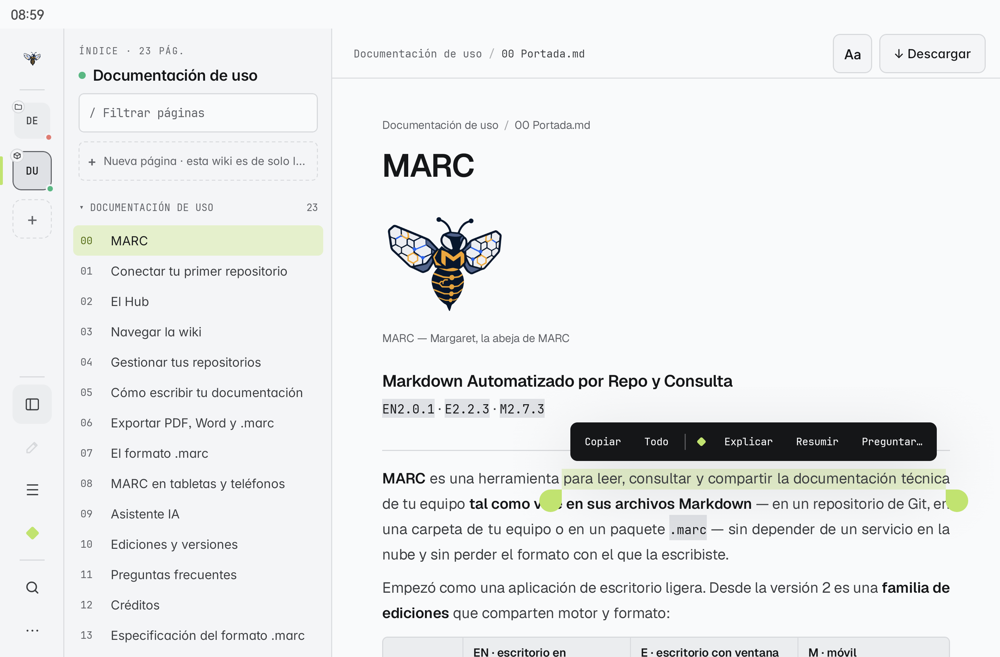

# Lectura cómoda y accesibilidad

MARC adapta la lectura a cada persona: tamaño, tipografía, espacios, colores, luz de noche, ayudas para la vista y un lector de voz. Los ajustes son **tuyos** (de tu equipo), valen para todas las wikis y **no cambian los archivos**. Está en **M** completo y en **E** (todo menos la voz, que llegará después).

## El botón «Aa»

En la barra de la página, **«Aa»** abre lo más usado sin salir de la lectura:

| Opción | Qué hace |
|---|---|
| **Tamaño** | Agranda o achica el texto de la página |
| **Modo dislexia** | Activa la configuración pensada para dislexia (abajo) |
| **Luz de noche** | Tono cálido sobre toda la app, con su intensidad |
| **Escuchar esta página** | Empieza a leer en voz alta (M) |
| **Más ajustes de lectura →** | Abre **Ajustes → Accesibilidad** |

## Ajustes → Accesibilidad

### Lectura

| Ajuste | Opciones |
|---|---|
| **Tipografía** | El del dispositivo, Lexend, Arial (Arimo), Verdana (DejaVu Sans), Comic (Comic Neue) |
| **Tema de lectura** | Automático, Crema, Gris claro, Oscuro suave |
| **Interlineado**, **Espacio entre letras**, **Espacio entre palabras** | Deslizadores |
| **Alineación de párrafos** | Izquierda o **Justificar**, y en justificado, la **Última línea**: izquierda, centro o derecha |
| **Guiones automáticos** | Corta palabras largas al final de la línea (en Android) |
| **Las cursivas se muestran** | Normales o **En negrita** (las cursivas cuestan más a muchos lectores) |

### Modo dislexia

**Activar modo dislexia** aplica en un paso: tipografía **Lexend**, texto más grande, **más espacio** entre letras, palabras y líneas, fondo **crema**, alineación a la izquierda y cursivas sin inclinar. Mientras está activo, esos ajustes dicen *"Controlado por el modo dislexia"*; al apagarlo vuelven los tuyos.

> [!info] ¿Por qué tanto espacio?
> El espacio extra entre letras y líneas reduce que las letras "se amontonen" y que la vista salte de renglón; el fondo crema baja el contraste duro del blanco. Son recomendaciones de guías de lectura accesible (por ejemplo, la British Dyslexia Association).

### Luz de noche

Filtro cálido sobre **toda** MARC (no solo la página), con **Intensidad**. **Encender solo de noche** la enciende y apaga sola en el horario que elijas (**Desde** / **Hasta**).

### Ayudas de lectura

| Ayuda | Qué hace |
|---|---|
| **Énfasis de lectura** | Pone en negrita el **inicio de cada palabra** para guiar la vista |
| **Regla de lectura** | *"Resalta una franja y atenúa el resto; muévela con su asa."* Arrastra el asa de la derecha para seguir la línea |

## Lector de voz (M)

**«Aa» → Escuchar esta página** lee la página en voz alta:

- La **frase** que se lee queda resaltada y la página la sigue sola.
- Abajo aparece un **reproductor**: frase anterior, pausa, siguiente, **Velocidad** y detener.
- Lee el título y el texto de la página (títulos, párrafos, listas, citas y avisos); salta tablas, código, diagramas y fórmulas.

En **Ajustes → Accesibilidad → Lector de voz** eliges **Motor de voz**, **Idioma de la voz** y **Velocidad**, y pulsas **Probar voz**, que dice *"Hola. Esta es la voz de MARC."* y explica el resultado.

### Si no se oye

MARC usa el **motor de voz del sistema**. Qué instalar depende de tu tableta:

| Tableta | Qué hacer |
|---|---|
| **Android con servicios de Google** (Samsung, Lenovo, Xiaomi…) | Instala o actualiza **Servicios de voz de Google** (Speech Services by Google) y, en sus ajustes, **descarga la voz de tu idioma** |
| **Huawei** (sin servicios de Google) | El motor de Huawei funciona con MARC, pero **su voz no suele venir descargada**. Sigue los pasos de [[20 Lectura cómoda y accesibilidad#Voz en Huawei\|Voz en Huawei]] |
| **Otras tabletas sin Google** | Instala **SherpaTTS** (gratis, en F-Droid), ábrelo una vez y **descarga la voz de tu idioma**; luego elígelo en **Motor de voz** de MARC |

> [!tip] El volumen
> La voz usa el **volumen multimedia** (el de la música y los videos), no el del timbre.

### Voz en Huawei

En una tableta Huawei tienes tres opciones. La más sencilla es la primera.

**1 · Motor de Huawei (recomendado)**

1. En MARC, **Ajustes → Accesibilidad → Lector de voz → Ajustes de voz del sistema**.
2. En **Motor preferido** verás seleccionado el motor de Huawei, la opción de **escuchar una muestra** y el texto **Estado del idioma predeterminado** con el aviso de que tu idioma **se admite totalmente**.
3. Si aun así la muestra no se oye, toca la **ⓘ** que está a la derecha del motor. Verás dos opciones:
   - **Idioma**: deja el de tu sistema, o elige otro si quieres oír la voz en otro idioma.
   - **Ajustes del motor de texto a voz de Huawei**: aquí está la solución.
4. Entra en **Ajustes del motor de texto a voz de Huawei → Modelo de voz**, busca tu idioma y **descárgalo**. Normalmente no viene descargado.
5. Vuelve a **Ajustes → Texto a voz**, escucha la muestra: ya se oye el motor de Huawei. En MARC, pulsa **Probar voz** y ajusta la **Velocidad**.

**2 · Servicios de voz de Google**

Si instalaste los servicios de Google (por ejemplo, con GBox), instala **Servicios de voz de Google**, descarga la voz de tu idioma en sus ajustes y elígelo en **Motor de voz** de MARC.

**3 · SherpaTTS**

Aplicación gratuita de F-Droid: ábrela una vez, descarga la voz de tu idioma y elígela en **Motor de voz** de MARC.

> [!note] SherpaTTS no viene con MARC
> Es una aplicación aparte, de código abierto, que instalas tú. MARC no la incluye por su licencia; solo la recomienda y la usa si la eliges.

## Copiar y Todo (M)

Al **mantener pulsado** un texto de la página aparece la barra de selección con **Copiar** y **Todo** (seleccionar toda la página), además de las acciones de MARC (preguntar al asistente, etc.).

> [!note] Para probarlo
> Página **03 Lectura cómoda** de la [[22 Practica las funciones|wiki de práctica]]: tiene párrafos largos, cursivas y frases pensadas para probar cada ajuste y la voz.
