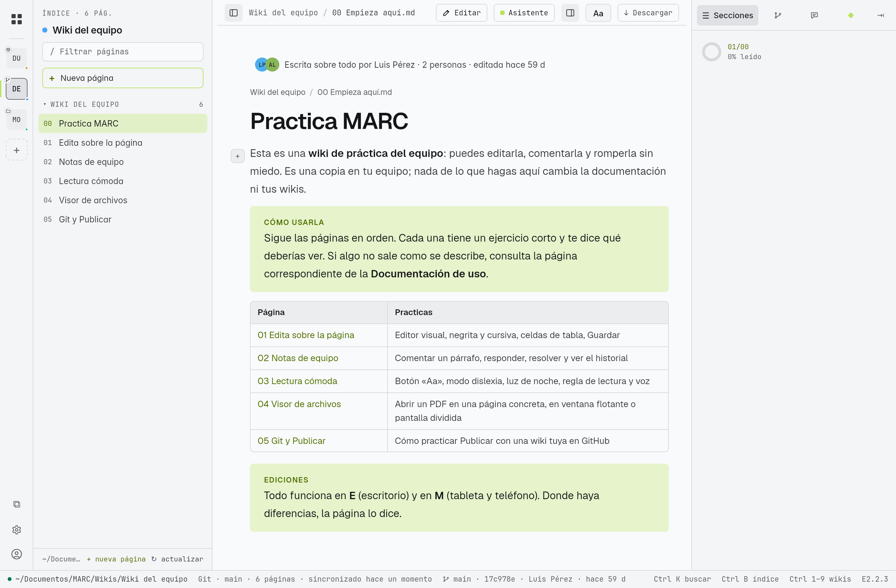
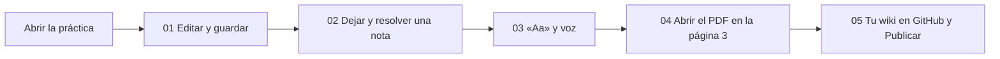

# Practica las funciones

Esta documentación es de **solo lectura**. Para probar todo sin miedo a romper nada hay una **wiki de práctica** editable, con ejercicios cortos que dicen qué deberías ver.

## Abrir la wiki de práctica

**[Abrir la wiki de práctica (Practica MARC.marc)](assets/pruebas/Practica%20MARC.marc)**

MARC la abre como una wiki más, **desde una copia**: lo que edites, comentes o guardes ahí no toca esta documentación ni tus wikis. Si quieres empezar de cero, vuelve a pulsar el enlace.

> [!tip] Si la abres fuera de MARC
> También puedes descargar el archivo `Practica MARC.marc` y abrirlo con doble clic (E) o con **Abrir con MARC** (M).

## Qué trae

| Página de práctica | Practicas | Explicación completa |
|---|---|---|
| 00 Empieza aquí | Cómo usar la práctica | — |
| 01 Edita sobre la página | Visual, negrita y cursiva, celdas de tabla, Guardar | [[17 Editar sobre la página]] |
| 02 Notas de equipo | Comentar, responder, resolver, reabrir, editar y borrar | [[19 Notas de equipo]] |
| 03 Lectura cómoda | «Aa», modo dislexia, luz de noche, regla, énfasis, voz | [[20 Lectura cómoda y accesibilidad]] |
| 04 Visor de archivos | Abrir el manual en la página 3 y 6, texto plano, flotante o dividida | [[21 Visor de archivos]] |
| 05 Git y Publicar | Crear tu propia wiki en GitHub y probar Publicar, unir y actualizar | [[18 Publicar cambios (Git)]] |
| `anexos/` | `manual-de-prueba.pdf` (8 páginas numeradas) y `notas-de-prueba.txt` | — |

## Recorrido sugerido (unos 20 minutos)

1. **Editar** un párrafo, una negrita y una celda; **Guardar** y comprobar que el resto quedó igual (pestaña Markdown).
2. Dejar una **nota**, responderla, **Resolver ✓** y ver el historial.
3. Activar el **modo dislexia** y la **luz de noche**; en M, **Escuchar esta página**.
4. Abrir el **manual en la página 3**: debe decir "Página 3".
5. Con tu [[15 Tu cuenta de GitHub|cuenta de GitHub]], **+ Conectar → Crear** una wiki privada en GitHub, editarla y **Publicar**. Luego cámbiala en github.com y pulsa **↻ actualizar**.

## Lo que no se prueba en la práctica

| Función | Por qué | Cómo probarla |
|---|---|---|
| Historial, autoría, comparar | La práctica se empaquetó desde una carpeta sin Git, así que no tiene repositorio que vincular | En tu wiki de GitHub del paso 5, después de dos o tres publicaciones ([[16 Historial y trabajo en equipo]]) |
| Notas como *issues* de GitHub | La práctica no está en GitHub | En tu wiki de GitHub del paso 5 ([[19 Notas de equipo]]) |
| Publicar | La práctica no tiene Git | Paso 5 |

## La documentación en PDF

Toda esta documentación también está en un solo PDF, con índice, para leerla o imprimirla: **[MARC — Documentación de uso.pdf](assets/MARC%20—%20Documentación%20de%20uso.pdf)**. Se abre en el [[21 Visor de archivos|visor]].
