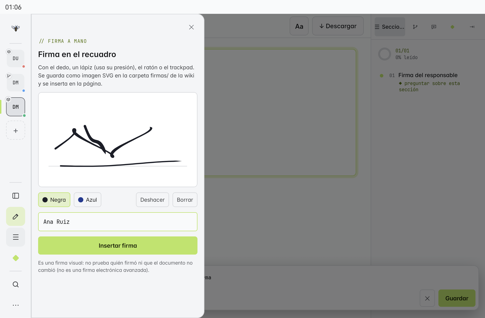
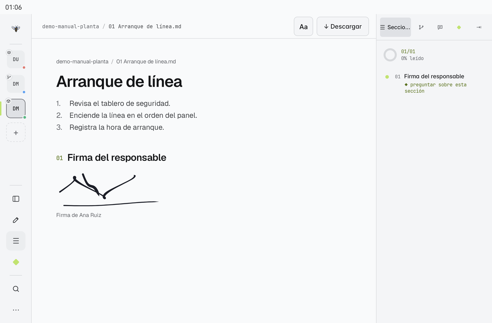

# Firmas a mano

Firma con el **dedo**, un **lápiz** (usa su presión real), el **ratón** o el **trackpad**: MARC dibuja el trazo como tinta sobre papel, con grosor variable y extremos afilados, y lo guarda en la wiki como una imagen **SVG** nítida a cualquier tamaño. Está en **M** desde M2.8.0; en **E** llega con su próxima versión.

## Firmar una página

1. Abre la página y entra a editar (M: lápiz de la barra lateral · E: **Editar**).
2. En la barra de edición pulsa **Firma**.
3. Firma sobre la línea del recuadro. **Deshacer** quita el último trazo y **Borrar** empieza de nuevo.
4. Elige la tinta (**Negra** o **Azul**) y escribe el **nombre de quien firma**: será el texto alternativo de la imagen («Firma de …»).
5. Pulsa **Insertar firma** y después **Guardar** la página.





## Dónde se guarda

La firma es un archivo normal de la wiki, en la carpeta `firmas/` junto a la página:

```markdown
{ width="240" }
```

Por eso viaja con todo lo demás, sin nada especial: se publica con Git ([[18 Publicar cambios (Git)]]), va dentro del `.marc` ([[07 El formato .marc]]) y sale en el PDF y el Word ([[06 Exportar PDF, Word y .marc]]). El ancho (`width`) se puede cambiar en la pestaña Markdown.

> [!tip] Reutilizar una firma
> Debajo del recuadro aparecen las **firmas de esta carpeta**: tócalas para insertarlas de nuevo sin volver a firmar.

| Entrada | Cómo se dibuja el grosor |
|---|---|
| Lápiz o pluma digital | Con la **presión real** del lápiz |
| Dedo, ratón o trackpad | Simulado por la **velocidad** del trazo: más rápido, más fino |

> [!warning] Firma visual, no firma electrónica
> Una firma dibujada es una **imagen**: no prueba quién firmó ni que el documento no cambió después. No equivale a una firma electrónica avanzada ni a una firma con certificado.

> [!note] Para probarlo
> En la [[22 Practica las funciones|wiki de práctica]], abre cualquier página, entra a editar y pulsa **Firma**.
