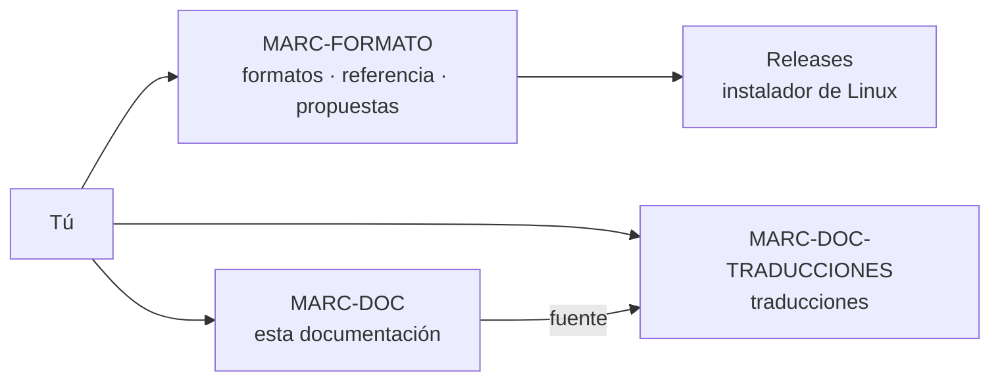

# Comunidad y repositorios

MARC tiene **repositorios públicos en GitHub** donde puedes descargar el instalador, leer los formatos abiertos, traducir esta documentación y proponer mejoras. Todos están en la cuenta [github.com/Anton-Bazh](https://github.com/Anton-Bazh).

| Repositorio | Dónde | Para qué | Idioma |
|---|---|---|---|
| :material-book-open-variant: **MARC-DOC** | [github.com/Anton-Bazh/MARC-DOC](https://github.com/Anton-Bazh/MARC-DOC) | Esta documentación de uso. MARC la descarga y la actualiza sola dentro de la aplicación | Español |
| :material-file-document-outline: **MARC-FORMATO** | [github.com/Anton-Bazh/MARC-FORMATO](https://github.com/Anton-Bazh/MARC-FORMATO) | Los **formatos abiertos** de MARC: la especificación del `.marc` (y, más adelante, la de las extensiones `.marcext`), una **implementación de referencia** para validar, abrir y crear `.marc` con tus propias herramientas, y las **propuestas y dudas** de la comunidad | Inglés |
| :material-translate: **MARC-DOC-TRADUCCIONES** | [github.com/Anton-Bazh/MARC-DOC-TRADUCCIONES](https://github.com/Anton-Bazh/MARC-DOC-TRADUCCIONES) | **Traducciones** de esta documentación a otros idiomas, hechas por la comunidad, con su guía, glosario y el estado de cada página | Inglés |

> [!info] ¿Por qué en inglés?
> MARC-FORMATO y MARC-DOC-TRADUCCIONES están en inglés para que cualquier persona, hable el idioma que hable, pueda leerlos y participar. Puedes escribir tus *issues* también en español.

## Descargar MARC para Linux

El **instalador de MARC E para Linux** (`.deb`, para Debian, Ubuntu y derivadas) está en las ***Releases*** de MARC-FORMATO y de MARC-DOC-TRADUCCIONES:

1. Entra a [Releases de MARC-FORMATO](https://github.com/Anton-Bazh/MARC-FORMATO/releases).
2. Descarga el archivo `marc_…_amd64.deb` de la versión más reciente.
3. Instálalo desde una terminal, en la carpeta donde lo descargaste:

   ```bash
   sudo apt install ./marc_2.3.0_amd64.deb
   ```

MARC se instala en `/opt/marc` y queda como programa para abrir los archivos `.marc` y `.md`. Las notas de cada *release* traen la suma SHA-256 del paquete para comprobar que la descarga está completa.

## Cómo participar

| Quieres | Dónde | Cómo |
|---|---|---|
| Reportar un error o una duda del formato `.marc` | MARC-FORMATO → *Issues* | Elige la plantilla *Bug report* o *Specification question* |
| Proponer un cambio al formato | MARC-FORMATO → *Issues* | Plantilla *Format proposal*, antes de enviar código |
| Crear `.marc` desde tus scripts o tu aplicación | MARC-FORMATO → carpeta `reference/` | Usa la implementación de referencia (Python, sin dependencias) o sigue la especificación |
| Traducir esta documentación | MARC-DOC-TRADUCCIONES | Lee `TRANSLATING.md`, elige una página libre en `STATUS.md` y envía un *pull request* |
| Empezar un idioma nuevo | MARC-DOC-TRADUCCIONES → *Issues* | Plantilla *New language* |
| Corregir esta documentación | MARC-DOC → *Issues* | Describe la página y lo que está mal |



> [!tip] Una traducción se puede ver en MARC
> Cada idioma de MARC-DOC-TRADUCCIONES es una wiki completa: clónalo y ábrelo con **+ Conectar → Carpeta local** para ver cómo queda tu traducción, con sus diagramas y avisos.

## Licencias

| Qué | Licencia | Qué te permite |
|---|---|---|
| Esta documentación, sus traducciones y las especificaciones | [CC BY 4.0](https://creativecommons.org/licenses/by/4.0/deed.es) | Copiar, traducir y adaptar, también con fines comerciales, citando la fuente |
| Implementación de referencia (`reference/` de MARC-FORMATO) | MIT | Usar el código en cualquier programa, abierto o cerrado |

El formato `.marc` es abierto: puedes leerlo y crearlo en cualquier programa sin pedir permiso. Ver también [[13 Especificación del formato .marc]] y [[12 Créditos]].
